<h1 align="center">KUKA Engineering Toolkit</h1>

  <b>Industrielles Engineering, Diagnose und Pre-Deployment-Analyse für KUKA-Roboter.</b> 
  <i>Verfügbar als VS Code Erweiterung.</i> 
  Entwickelt für <b>KRC2-, KRC4- und KRC5-Steuerungen (KSS 5.x – 8.7+)</b>.

Language / Язык / Dil / Sprache / Lingua / Idioma

| Language | File |
|---|---|
| English | [README.md](README.md) |
| Русский | [README.ru.md](README.ru.md) |
| Türkçe | [README.tr.md](README.tr.md) |
| Deutsch | [README.de.md](README.de.md) |
| Italiano | [README.it.md](README.it.md) |
| Español | [README.es.md](README.es.md) |

  
  
  
  
  

  
  
  
  
  
  
  

  <a href="https://liskinlabs.github.io/kuka-krl-extension/"><b>Interaktives Wiki & Dokumentation</b></a> •
  <a href="https://checkout.dodopayments.com/buy/pdt_0NmAUzwdbzeERSktsOLTp"><b>Pro Monthly ($19.00/Monat)</b></a> • 
  <a href="https://checkout.dodopayments.com/buy/pdt_0NmAV012KFHSjUMyDomJ6"><b>Pro jährlich ($149.00/Jahr – 35% sparen)</b></a> • 
  <a href="https://secure.software/vscode/packages/liskinlabs/kuka-krl-extension"><b>Sicherheitsaudit-Bericht</b></a>

---

## Bevor der Code auf den Roboter kommt (Before the robot)

> **KUKA-Programme, Backups, Ereignisprotokolle, I/O-Signale, Koordinaten und Bewegungspfade analysieren, bevor Änderungen auf die physische Steuerung übertragen werden.**

* **Produktionsstillstände verhindern**: Programmier-, Konfigurations- und Kollisionsrisiken vor dem Serienanlauf aufdecken.
* **Änderungen verstehen**: SmartPAD-Backups vergleichen und exakt ermitteln, was sich in `.src`- und `.dat`-Dateien geändert hat.
* **Engineering standardisieren**: KRL-Projekte automatisiert anhand eigener Werksstandards und Automobilrichtlinien (VASS 26) prüfen.

---

## Das Problem: $10.000 pro Stunde Produktionsstillstand

Jeder Inbetriebnahme-Ingenieur kennt den Schmerz:
1. **Der langsame Zyklus**: Dateien direkt am SmartPAD-K-Bedienpanel bearbeiten oder sich mit trägen WorkVisual-Deployments herumärgern.
2. **Das versteckte Kollisionsrisiko**: Eine einzige fehlende `$TOOL`- oder `$BASE`-Zuweisung, eine ungeprüfte Koordinatenverschiebung oder eine versehentliche kartesische `$VEL.CP`-Überschreitung, die beim ersten Automatiktest einen mechanischen Crash verursacht.
3. **Die ungeprüften Änderungen**: Kollegen passen Punkte in der Nachtschicht am Panel an – ganz ohne Versionskontrolle.

**KUKA KRL Professional** verwandelt Ihren Editor in ein leistungsstarkes **Industrie-Robotik-Kommandozentrum**. Es fängt Syntaxfehler, kinematische Fehler, fehlende Blockbalancen und Koordinatenabweichungen ab, **BEVOR** der Code jemals die physische Robotersteuerung erreicht.

> **Die ROI-Garantie:** Ein einziger Syntax-Crash oder eine mechanische Kollision, die vor dem Einsatz auf dem Hallenboden abgefangen wird, bezahlt in den ersten 5 Minuten eine lebenslange Pro-Lizenz.

---

## Professionelle Schlüsselfunktionen

### 1. Interaktives Flussdiagramm & Kontrollflussgraph
*Schluss mit dem manuellen Entwirren verschachtelter Logik.* Verwandle riesige, komplexe `.src`-Programme in saubere, interaktive, anklickbare Kontrollflussdiagramme.
* **Bidirektionales Code-Springen**: Klick auf einen Block – sofortiger Sprung zur exakten Codezeile.
* **Unterprogramm-Drill-Down**: Klick auf Aufrufe (z. B. `PickPart()`, `WeldSeam()`) lädt deren Flussdiagramme.
* **Signale & Timer**: Farbcodierte Status-Badges für E/A-Signale, Flags und Timer.
* **Integriertes Sicherheits-Panel**: Die vollständige Industrie-Sicherheitsanalyse läuft für das angezeigte Programm – Bewegungs-, Aktor- und Deadlock-Risiken mit Ein-Klick-Zeilennavigation.
* **SVG-Vektorexport**: Hochauflösende Vektordiagramme für Kundenübergaben und Automatisierungsdokumentation.

  

---

### 2. Industrie-Sicherheit & Tiefenlogik-Analysator
*Beseitigen Sie Syntax-Crashes, Deadlocks und Kollisionsrisiken, bevor der Code die Steuerung erreicht.*
* **Strikte Blockbalance**: Markiert verwaiste `IF / ENDIF`-, `FOR / ENDFOR`- und `LOOP / ENDLOOP`-Blöcke vor der KRC-Kompilierung.
* **Tool/Base-Prüfung**: Warnt, wenn Bewegungsbefehle (`PTP`, `LIN`, `CIRC`) ohne aktive `$TOOL`- oder `$BASE`-Initialisierung ausgeführt werden.
* **Geschwindigkeitsinspektor**: Warnt, wenn die kartesische Geschwindigkeit `$VEL.CP` sichere Inbetriebnahme-Grenzen überschreitet (> 2,0 m/s).
* **Deadlock-Blocker**: Markiert fehlende Timeouts bei `WAIT FOR`-Bedingungen und Endlosschleifen ohne `EXIT`.
* **Kyrillisch- & Nicht-ASCII-Blocker**: Erkennt versehentliche Nicht-ASCII-Zeichen, die ältere KSS-Compiler stillschweigend abstürzen lassen.

  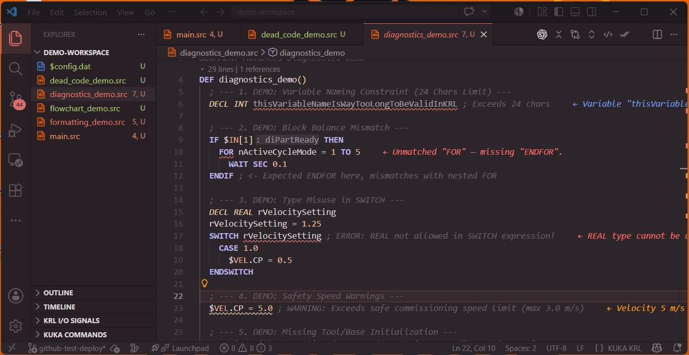

---

### 3. SmartPAD-ZIP-Backup-Diff & Punkt-Delta-Mathematik
*Vergleichen Sie Live-Projektcode mit `.zip`-Archiv-Backups vom SmartPAD.*
* **Delta-Mathematik**: Berechnet exakte 6-Achs-Verschiebungen (**ΔX, ΔY, ΔZ, ΔA, ΔB, ΔC**) für `E6POS`-, `POS`- und `E6AXIS`-Punkte.
* **Null-Kontakt-Audit**: Erkennt ungeprüfte Punktkorrekturen vom Hallenboden, bevor sie Kollisionen verursachen.
* **Side-by-Side-Diff**: Farbcodierter grafischer Diff-Viewer direkt in VS Code.

  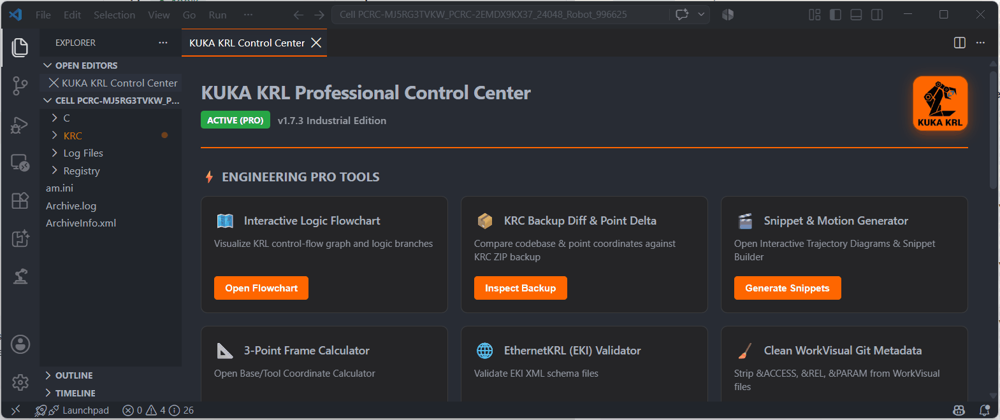

---

### 4. GitLens-starke KRL-Versionskontrolle
*Verfolgen Sie jede Koordinatenänderung und Programmmodifikation präzise.*
* **Zeilen-Blaming**: Autor, Zeitstempel und Commit-Details in der Statusleiste für jede KRL-Zeile.
* **Commit-Inspektor**: Klick auf das Blame in der Statusleiste zeigt vollständige Commit-Diffs, Metadaten und Verlauf.
* **Visuelle Dateihistorie (`krl.viewFileHistory`)**: Vergleich des aktuellen Codes mit jedem historischen Git-Commit im Side-by-Side-Diff.

---

### 5. 3-Punkt-Euler-Frame-Mathematik & KUKA Control Center
*Direkter Koordinatensystem-Umrechnungsrechner direkt im Editor.*
* **3-Punkt-Methode**: Berechnet `BASE_DATA`- und `TOOL_DATA`-Ursprünge und Euler-Winkel (A, B, C) aus gemessenen Kalibrierpunkten.
* **Direktes `.dat`-Einfügen**: Berechnete Koordinatenrahmen mit einem Klick in Datendateien einfügen.
* **Null Trigonometriefehler**: Schluss mit Tabellenkalkulationen und manueller Orientierungsmathematik im Werk.

  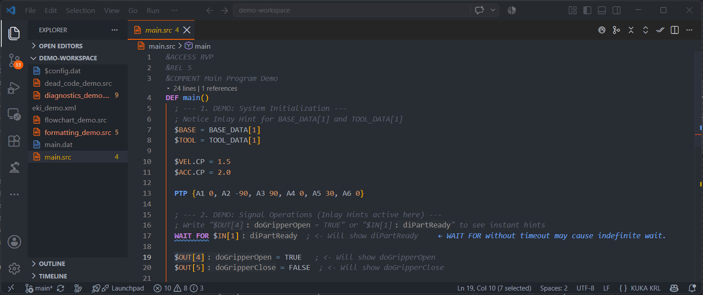

---

### 6. Signal-Inlay-Hinweise & PLC-Kommentar-Mapping
*Verstehen Sie die E/A-Logik auf einen Blick, ohne elektrische Schaltpläne zu wälzen.*
* Liest Signaldefinitionen direkt aus `$config.dat` und `kuka_signals.json`.
* Zeigt lesbare Bezeichnungen neben `$IN[x]`, `$OUT[y]`, `$ANIN[z]` und `$FLAG[k]`.

  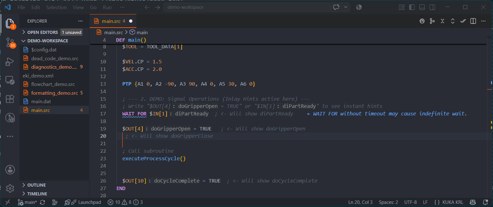

---

### 7. Automatischer Code-Formatter & Matrix-Ausrichtung
*Verwandeln Sie handschriftliches Chaos mit einem Tastendruck (`Shift+Alt+F`) in sauberen, standardisierten Industrie-Code.*
* Normgerechte 3-Leerzeichen-Einrückung nach KUKA-Standard.
* Richtet `=`-Zuweisungen in `.dat`-Dateien für lesbare Koordinatenmatrizen aus.
* Groß-/Kleinschreibungs-Normalisierung für KRL-Schlüsselwörter (`DEF`, `GLOBAL`, `INTERRUPT`, `CONTINUE`).

  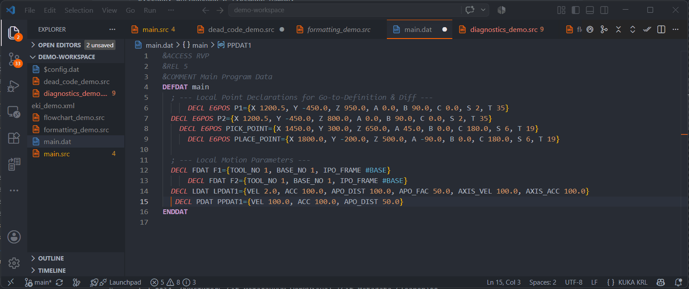

---

### 8. KRL-Spezifikationsdatenbank & 957+ Systemvariablen
*Unabhängig entwickelte Spezifikationen, die den KRL-Sprachstandards und der offiziellen KSS- und iiQWorks-Dokumentation entsprechen.*
* **957 Systemvariablen**: Vollständige Abdeckung der KSS-8.3–8.7/9.0-Systemvariablen (`$ACC`, `$TOOL`, `$BASE`, `$POS_ACT`, `$VEL_AXIS` u. a.) mit physikalischen Einheiten, Array-Grenzen (217 Arrays) und Read-Only-Status.
* **116 eingebaute Systemfunktionen & Wonderlib**: Volle Laufzeitunterstützung für Kinematik (`FORWARD`, `INVERSE`, `INV_POS`, `TOOL_ADJ`), String-Operationen, Typkonvertierung, Meldungsdialoge, Drehmomentgrenzen und Wonderlib-Routinen mit Echtzeit-`signatureHelp`.
* **111 Strukturen & 112 ENUMs (443 Literale)**: Intelligente Punkt-Vervollständigung (`$TOOL.`, `$ACC.`, `POINT.`) und `#`-Enum-Autovervollständigung (`#AUT`, `#T1`, `#P_FREE`, `#QUIT`).
* **23 standardmäßige KRL-Inline-Form-Snippets (34 Vorlagen)**: Bewährte KRL-Vorlagen (`ptpi`, `slini`, `sptpi`, `scirc`, `PTPCo`, `ptprel`, `trigdist`, `sigin`, `wsec`, `Forr`) mit vollständigen Inline-Form-Headern (`;FOLD ... ;%{PE}`).
* **451-Schlüsselwort-KRL-Matrix**: Vollständige Abdeckung der KRL-Standardsyntaxregeln – null False-Positive-Syntaxwarnungen.
* **Einfache Anführungszeichen für Hex & Binär**: Volle Parser- und Diagnoseunterstützung für `'B000001'` (binär), `'HFF'` (hexadezimal) und Zeichenliterale.
* **Zero-False-Positive-Flottenaudit (4,1 Mio.+ Zeilen)**: Verifiziert an 107 realen Produktions-Roboterbackups mit 0 falschen Diagnosen.

  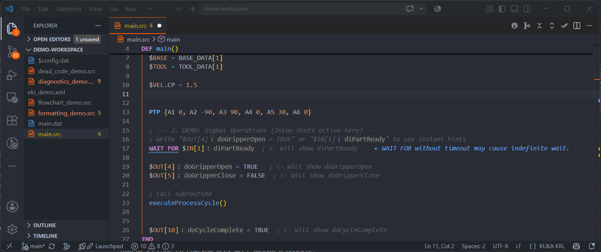

---

### 9. Gehe zu Definition & Alle Referenzen finden
*Sofortige AST-Indizierung über den gesamten Projektordner.* Springen Sie von jedem Funktions- oder Variablenaufruf direkt zur Deklaration in getrennten `.src`- und `.dat`-Dateien.

  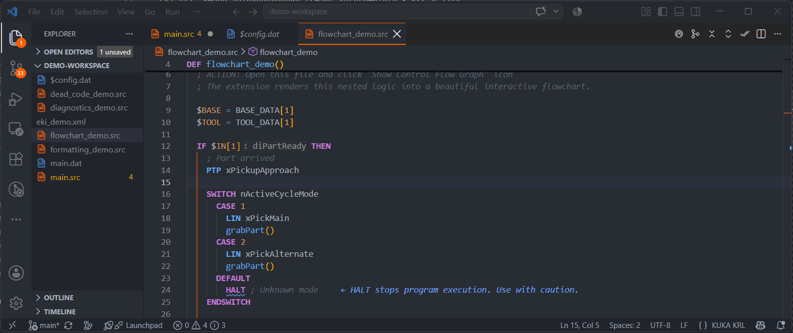

---

### 10. Umfangreiche Hover-Dokumentation & Schreib-/Lesestatus
*Sofortige Parametererklärungen und Sicherheitswarnungen.* Bewegen Sie den Mauszeiger über eine KSS-Systemvariable, um physikalische Einheiten, Schreib-/Leseberechtigungen und Beschreibungen aus dem KSS-Handbuch zu sehen.

  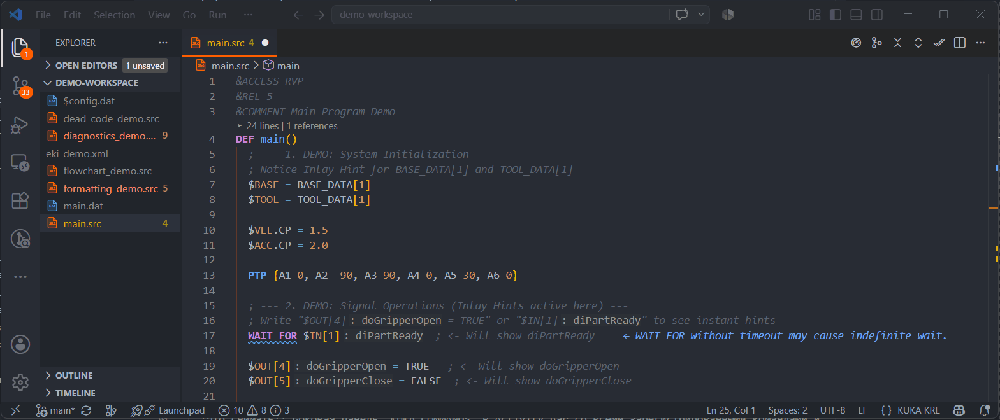

---

### 11. Git-Metadaten-Reinigung & Servicemetadaten-Stripper
*Halten Sie die Versionskontrolle sauber.* Entfernen Sie Servicedirektiven (`&ACCESS`, `&REL`, `&PARAM`, `&COMMENT`) mit einem Klick – keine rauschenden Git-Diffs mehr bei automatisierten Commits.

  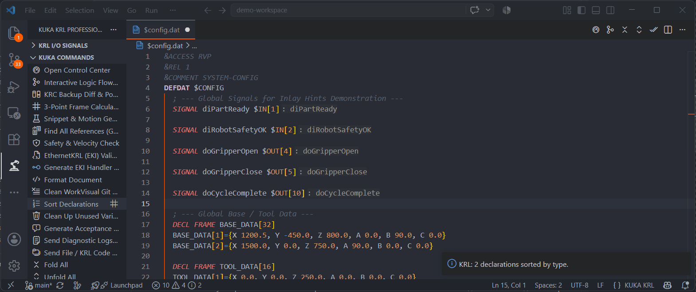

---

### 12. Modernes KRL & iiQKA-FOLD-Suite
*Heben Sie Ihren Code mit einem Klick auf moderne KUKA-Standards.*
* **Auswahl in iiQKA-FOLD konvertieren (`krl.wrapIiQkaFold`)**: Eigene Logik in standardisierte iiQKA-Faltblöcke verpacken.
* **In Spline-Block konvertieren (`krl.wrapSplineBlock`)**: Linear- und Kreisbewegungen in leistungsfähige `SPLINE`- / `ENDSPLINE`-Blöcke für KSS 8.3–8.7 verpacken.
* **Kollisionsschutz-Injektor (`krl.insertCollisionGuard`)**: Injiziert automatisch `$TORQMON`-Drehmomentüberwachungsrahmen um kritische Bewegungszonen.
* **FOLDs bereinigen & entfalten (`krl.cleanUnwrapFolds`)**: Veraltete Inline-Forms sicher entfalten, interne Bewegungsbefehle bleiben erhalten.

---

### 13. Live-Support-Gateway & Remote-Telepräsenz
*Direkter Zwei-Wege-Support-Chat mit den Entwicklern – direkt in VS Code.*
* **Interaktives Chat-Panel**: Sofortige forenbasierte Thread-Synchronisierung mit dem Entwicklungs-Support.
* **Smart Diff & Apply**: Ein-Klick-Prüfung und automatische Übernahme von Code-Fixes, die der technische Support vorschlägt.
* **Remote-Telepräsenz & Diagnose**: Optionale, abgesicherte Telemetriebefehle (`/ai_diag`, `/logs`, `/sysinfo`, `/ping`) für schnelle Inbetriebnahme-Unterstützung.

---

### 14. Schnell-Fold-Leiste & Deklarationssortierung
*Verwalten Sie riesige Programme mühelos.* Ein-Klick-Faltung von FOLD-Blöcken und Unterprogrammen sowie automatische Sortierung von Variablendeklarationen.

  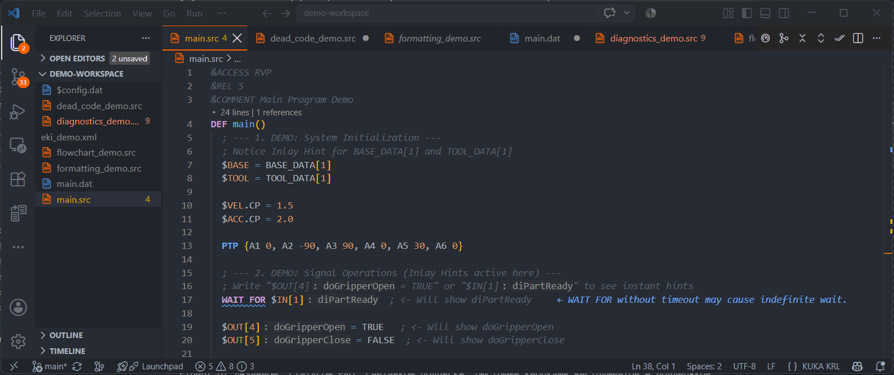

---

### 15. Dead-Code- & Unused-Global-Function-Analyse
*Verhindern Sie Code-Aufblähung und übrig gebliebene Testroutinen.* Finden Sie unaufgerufene Unterprogramme, ungenutzte Variablen und unerreichbare Codezweige im gesamten Workspace.

  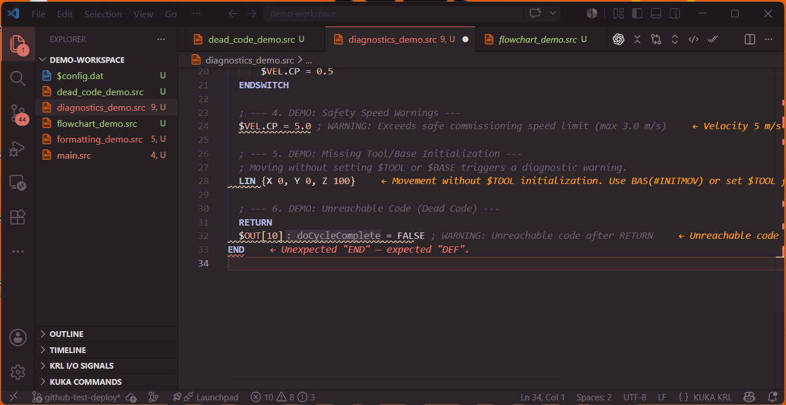

---

### 16. Hochkontrast-Syntaxpalette & KSS-Systembibliothek
*Umfangreiche Farbpalette und Systemkontext für professionelle KRL-Entwicklung.*
* **Vielfältige Hochkontrast-Palette**: Farbschemata im Industriestil (KRL Dark und Light). Differenzierte Scopes für Bewegungsbefehle (fett), bitweise/logische Operatoren, mathematische Symbole, Systemdirektiven (`&ACCESS`, `&REL`) und Hex-/Binärzahlen (`'H...'`, `'B...'`).
* **KSS-8.7-Standard-Systembibliothek**: Eingebaute Definitionen, Parameterhilfe und `F12` (Gehe zu Definition) für `BAS()`, `MsgNotify()`, `MsgQuit()`, `MsgDialog()`, `USE_CM_PRO_VALUES()`, `TOOL_NAME[]` und `BASE_NAME[]` – direkt zu den offiziellen KSS-8.7-Referenzmodulen.
* **1-Klick-KSS-8.7-Projektgerüst (`krl.scaffoldKrcFiles`)**: Erzeugt automatisch den Standard-Ordnerbaum `KRC/R1/System/`, `KRC/R1/Program/` und `KRC/R1/TP/` mit `$config.dat`, `bas.src`, `MsgLib.src`, `collmonlib.src` und `sps.sub`.
* **Werksvorgaben & Advance-Run-Limiter**: Sofortige Hover-Anzeige der offiziellen Werkswerte (`operate.defaultvalues`) für `$ADVANCE = 3`, `$VEL.CP = 2,0 m/s`, `$ACC.CP = 2,3 m/s²`, `$JERK.CP = 500,0 m/s³` und automatische Linter-Warnungen, wenn `$ADVANCE` den gültigen Bereich `0..5` überschreitet.

---

## Feature-Vergleichsmatrix

| Feature | Community (kostenlos) | Pro Industrial | Nutzen für Ingenieure |
|:---|:---:|:---:|:---|
| **KRL-Syntaxhervorhebung** (`.src`, `.dat`, `.sub`, `.kfd`) | Ja | Ja | Vollständige AST-Färbung mit KUKA-KRL-Farbpalette |
| **KRL-Themes (Dark & Light)** | Ja | Ja | Industrielle Farbschemata mit hohem Kontrast |
| **Smarte Autovervollständigung & System-Spezifikationen** (957+ Variablen, 116 Funktionen, 111 Strukturen) | Ja | Ja | Vollständige KSS-Systemvariablen & Signaturhilfe |
| **KSS-8.7-Standard-Systembibliothek & F12-Definition** | Ja | Ja | Sofortiger F12-Sprung zu `bas.src`, `MsgLib.src`, `$config.dat` |
| **1-Klick-KRC-Projektgerüst** | Ja | Ja | Initialisiert die Standard-`KRC/R1/System`-Ordnerstruktur |
| **Werksvorgaben-Hover & $ADVANCE-Limiter** | Ja | Ja | Zeigt Werksvorgaben und warnt bei `$ADVANCE > 5` |
| **23 standardmäßige Inline-Form-Snippets** (34 Bewegungs- & Logikvorlagen) | Ja | Ja | Vollständige `;FOLD ... ;%{PE}`-Vorlagen |
| **Signal-Inlay-Hinweise & Hover-Dokumentation** | Ja | Ja | Inline-PLC-Signalbeschriftungen & Parametersignaturen |
| **Code-Formatter & Matrix-Ausrichtung** | Ja | Ja | Sofortige 1-Klick-Bereinigung (`Shift+Alt+F`) |
| **GitLens-Zeilenblame & Verlauf** | Ja | Ja | Sofortige Autor- & Commit-Verfolgung für jeden Punkt |
| **Hexa-Locale-Architektur** (EN, DE, IT, ES, RU, TR) | Ja | Ja | Vollständige native UI, 515 UI-Schlüssel & 1.073 Übersetzungen von Systemvariablendokumentation |
| **Git-Metadaten-Reinigung** | Ja | Ja | Entfernt Servicemetadaten-Header (`&ACCESS`, `&REL`) für saubere Git-Diffs |
| **Control Center & 21-Karten-Referenzleitfaden** | Ja | Ja | Echtzeit-Diagnoseschalter & In-Editor-Shortcut-Guide |
| **Voller flacher 36-Befehle-Seitenleistenbaum** | Ja | Ja | Jeder Erweiterungsbefehl mit einem Klick erreichbar |
| **Nativer Projekt-ZIP-Export & Remote-Telepräsenz** | Ja | Ja | 1-Klick-Vollbackup in den Explorer oder zu Telegram |
| **Copilot-AI-Language-Model-Tools-Integration (`krl_safety_check`)** | — | **Pro** | Sicherheitsprüfung direkt von der VS-Code-AI aufrufbar |
| **B2B-Rechnungen & Angebote (`krl.requestCorporateInvoice`)** | Ja | Ja | B2B-Angebotsanforderung mit USt-IdNr. / Reverse Charge direkt im Editor |
| **Grundlegende Syntax- und Diagnoseprüfung** | Ja (Bonus) | Ja | KRL-Syntaxvalidierung & grundlegende Fehlererkennung |
| **KSS 9.x / iiQWorks 9.+ & KSS 8.3–8.7 Kompatibilität** | Ja | Ja | Volle Unterstützung für KSS 9.x, iiQWorks sowie KRC2–KRC5 |
| **SmartPAD-Backup-Qualitäts-Abnahmebericht** | — | **Pro** | Automatisiertes Projekt-Audit mit Roboterpass und klickbaren Hyperlinks |
| **Modernes KRL & iiQKA-FOLD-Suite** | — | **Pro** | iiQKA-FOLDs, Spline-Blöcke & Kollisionsschutz |
| **Interaktiver Flussdiagramm-Viewer** (Mermaid SVG) | — | **Pro** | Visuelle Kontrollflusslogik & 2-Wege-Code-Sprung |
| **Strikte Blockbalance-Diagnose** | — | **Pro** | Fängt ungeschlossene `IF/LOOP/FOR`-Blöcke |
| **Geschwindigkeits- & Sicherheitsinspektor** ($VEL.CP) | — | **Pro** | Verhindert gefährliche kartesische Geschwindigkeitsüberschreitungen |
| **Tool-/Base-Prüfung** | — | **Pro** | Markiert Bewegungen vor der Frame-Initialisierung |
| **SmartPAD-ZIP-Backup-Diff & Punkt-Delta** | — | **Pro** | Berechnet exakte Koordinatendeltas (ΔX, ΔY, ΔZ) |
| **3-Punkt-Euler-Frame-Rechner** | — | **Pro** | Berechnet `BASE_DATA`/`TOOL_DATA` im Editor |
| **EthernetKRL-(EKI)-XML-Suite** | — | **Pro** | Live-XML-Vorlagen-Generator & -Validator |
| **Live-Support-Gateway & Remote-Telepräsenz** | — | **Pro** | Direkter 2-Wege-Helpdesk-Chat, Diff & Apply |
| **Dead-Code- & Scope-Checker** | — | **Pro** | Findet ungenutzte Variablen & tote Unterprogramme |
| **Bewegungsdiagramme & Spline-Generator** | — | **Pro** | Visualisiert Spline-Kurven für KSS 8.3+ |
| **100 % Offline-Werkszugriff** | Ja | **Pro** | Null Internetbedarf auf dem Hallenboden |

---

## Upgrade auf Pro: Preise & Sofortlizenzierung

Wir bieten flexible Lizenzierung auf Industrieniveau über unseren verifizierten Zahlungsdienstleister **Dodo Payments**. Alle Transaktionen sind verschlüsselt und unterstützen Kreditkarten, Apple Pay, Google Pay und PayPal in über 135 Ländern mit automatischen Mehrwertsteuer-/Steuerrechnungen.

### Tarife:

| Tarif | Preis | Rabatt / Abrechnung | Lizenzbedingungen | Checkout |
|:---|:---:|:---|:---|:---:|
| **Community** | **$0** | 100 % für immer kostenlos | Private & kommerzielle Nutzung | [Kostenlos installieren](https://marketplace.visualstudio.com/items?itemName=LiskinLabs.kuka-krl-extension) |
| **Pro Monatlich** | **$19.00** / Monat | Monatliche Abrechnung | Alle Pro-Werkzeuge • 1 PC • KRC2–KRC5-Support | [Pro Monthly sichern](https://checkout.dodopayments.com/buy/pdt_0NmAUzwdbzeERSktsOLTp) |
| **Pro Jährlich** | **$149.00** / Jahr | **35 % sparen** (~$6.58/Monat) | Alle Pro-Werkzeuge • 1 PC • 30-Tage-Offline-Puffer • KRC2–KRC5 | [Pro jährlich sichern](https://checkout.dodopayments.com/buy/pdt_0NmAV012KFHSjUMyDomJ6) |
| **Pro Lifetime** | **$699.00** | **Einmal zahlen, für immer besitzen** | Alle Pro-Werkzeuge • 1 PC (1 Arbeitsplatz) • Lifetime-Updates | [Lifetime Pro sichern](https://checkout.dodopayments.com/buy/pdt_0NmAcoqVCfuwQ6Xx7qyqr) |
| **Team Edition** | **$499.00** / Jahr | B2B — Rechnung & Angebot | Alle Pro-Werkzeuge • 25 Arbeitsplatz-Aktivierungen • KRC2–KRC5 | [Team Edition sichern](https://checkout.dodopayments.com/buy/pdt_0NnLCdgD69GiXDLRJ0K5v) |
| **Enterprise Site** | **$2,490.00** / Jahr | 200 Arbeitsplätze | Alle Pro-Werkzeuge • 200 Werks-Arbeitsplätze • Gebrandete Berichte | [Enterprise sichern](https://checkout.dodopayments.com/buy/pdt_0NnLCdkLwd0dECkpSE1JP) |

  <a href="https://checkout.dodopayments.com/buy/pdt_0NmAV012KFHSjUMyDomJ6" style="text-decoration:none;">
    <kbd style="font-size: 1.25em; padding: 14px 32px; background-color: #FF6600; color: white; border-radius: 10px; font-weight: bold; border: 1px solid #d15500; cursor: pointer; box-shadow: 0 4px 18px rgba(255,102,0,0.4);">
      Tarif wählen & abonnieren (Dodo Checkout)
    </kbd>
  </a>
  
Sofortige 1-Klick-Aktivierung in VS Code • 14-Tage-Grace-Period-Schutz • 30-Tage-Offline-Puffer

---

## 14-Tage-Grace-Period & Offline-First-Garantie

Inbetriebnahme-Ingenieure arbeiten in störungsreichen Werken, Reinräumen und Automobilzellen mit **null Netzwerkverbindung**.

* **30-Tage-Offline-Puffer**: Einmal aktivieren und bis zu 30 Tage komplett offline im Werk arbeiten – ohne Netzwerk-Handshakes.
* **14-Tage-Grace-Period**: Schlägt eine internationale Zahlungsmethode oder Kartenverlängerung vor Ort vorübergehend fehl, sperren Pro-Funktionen **Sie mitten in der Inbetriebnahme niemals aus**. Die Erweiterung bietet ein 14-tägiges Grace-Fenster mit intelligenten automatischen Hintergrund-Wiederholungen.

---

## Enterprise-Sicherheitszertifizierung

KUKA KRL Professional ist von **ReversingLabs Spectra Assure** mit einem **100 % Security Health Score** zertifiziert:
* **0 Malware** (saubere Binärprüfung)
* **0 CVE-Schwachstellen** in allen Abhängigkeiten
* **0 Secret-/Token-Leaks**
* **0 MITRE-ATT&CK-Indikatoren**

Offizielles Sicherheitsaudit: [https://secure.software/vscode/packages/liskinlabs/kuka-krl-extension](https://secure.software/vscode/packages/liskinlabs/kuka-krl-extension)

---

## Tastenkürzel

| Kürzel | Aktion | Bereich |
|:---|:---|:---|
| `Shift + Alt + F` | Dokument formatieren (KRL-3-Leerzeichen-Einrückung & Matrixausrichtung) | Aktiver Editor |
| `Ctrl + Alt + F` | Interaktives Flussdiagramm öffnen | `.src`-Datei |
| `Ctrl + Alt + D` | Industrie-Sicherheits- & Diagnoseprüfung ausführen | Workspace |
| `Ctrl + Alt + B` | SmartPAD-Backup-Diff & Punkt-Delta-Inspektor öffnen | Aktives Projekt |
| `Ctrl + Alt + K` | KUKA Control Center & 3-Punkt-Frame-Mathematik starten | Aktiver Editor |
| `Ctrl + Space` | Smarte KSS-Autovervollständigung auslösen | Cursorposition |

---

## Konfigurationseinstellungen

Konfigurieren Sie das Verhalten der Erweiterung in Ihrer `settings.json`:

| Einstellung | Standard | Beschreibung |
|:---|:---:|:---|
| `krl.indentWidth` | `3` | Einrückungsgröße (3 Leerzeichen sind der offizielle KUKA-Standard). |
| `krl.alignAssignments` | `true` | `=`-Symbole in `.dat`-Dateien für saubere Matrizen automatisch ausrichten. |
| `krl.errorLens.enabled` | `true` | Diagnosefehler inline am Zeilenende anzeigen. |
| `krl.validateNonAscii` | `true` | Nach Kyrillisch-/Nicht-ASCII-Zeichen suchen, die ältere KSS-Compiler brechen. |
| `krl.inlayHints.enabled` | `true` | Beschreibende Namen für E/A-Signale inline anzeigen. |

---

## Dokumentation & Wiki

* **Englische Dokumentation**: [https://liskinlabs.github.io/kuka-krl-extension/](https://liskinlabs.github.io/kuka-krl-extension/)
* **Русская документация и Вики**: [https://liskinlabs.github.io/kuka-krl-extension/ru/](https://liskinlabs.github.io/kuka-krl-extension/ru/)
* **Türkçe Dokümantasyon ve Wiki**: [https://liskinlabs.github.io/kuka-krl-extension/tr/](https://liskinlabs.github.io/kuka-krl-extension/tr/)

---

## Lizenz & Credits

* **Publisher & Entwickler**: [Liskin Labs](https://github.com/LiskinLabs) / [Silvestr Liskin](https://www.linkedin.com/in/silvestr-liskin-ab712920b/)
* **Sicherheitsauditor**: [ReversingLabs Spectra Assure](https://secure.software/vscode/packages/liskinlabs/kuka-krl-extension)
* **Offizieller Zahlungsdienstleister**: [Dodo Payments](https://dodopayments.com/)
* **Lizenz**: Kommerzielle EULA ([LICENSE](LICENSE))

---

## Rechtlicher Hinweis, Marken & Sicherheitskonformität

### Industrielle Sicherheit & Normenkonformität (ISO 10218-1/-2 & ISO 13849-1)
**KUKA KRL Professional** ist ein unabhängiges Engineering-, statisches Analyse- und Backup-Vergleichswerkzeug von **Liskin Labs**. Es ist **KEINE sicherheitszertifizierte Software (Non-SIL / Non-PL)** und ersetzt **keine** vorgeschriebenen physischen Inbetriebnahmeprüfungen, Override-Reduzierungen (`$OV_PRO <= 30%` im Handbetrieb T1 auf dem physischen KUKA SmartPAD) oder formelle Risikobeurteilungen nach **ISO 10218-1/-2** und **ISO 13849-1**. Vor der automatischen Produktion sind manuelle Testläufe im T1-Modus durchzuführen.

### Marken & Haftungsausschluss
* **KUKA®, KRL®, KRC®, WorkVisual®, iiQWorks® und SmartPAD®** sind eingetragene Marken der **KUKA AG** / **KUKA Deutschland GmbH**.
* **Visual Studio Code® und VS Code®** sind eingetragene Marken der **Microsoft Corporation**.
* Diese Software-Erweiterung ist eine unabhängige Entwicklung von **Liskin Labs** und steht in **keiner** Verbindung zu KUKA AG oder Microsoft Corporation, wird von diesen weder gesponsert noch unterstützt oder zertifiziert. Alle genannten Produktnamen und Marken sind Eigentum der jeweiligen Inhaber und dienen ausschließlich der Kompatibilitätsbeschreibung (nominative fair use).
