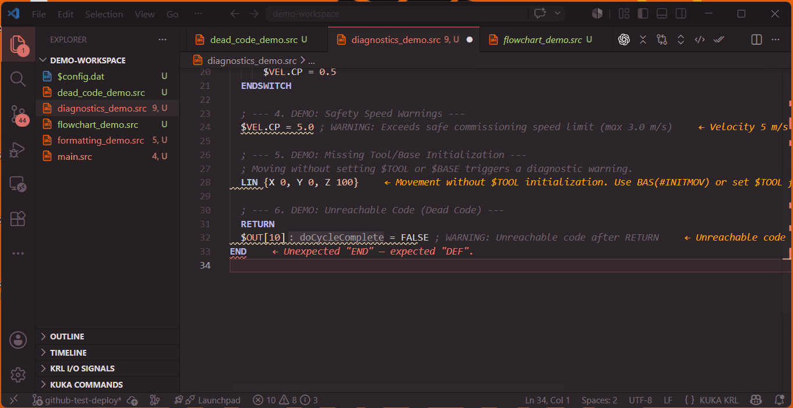
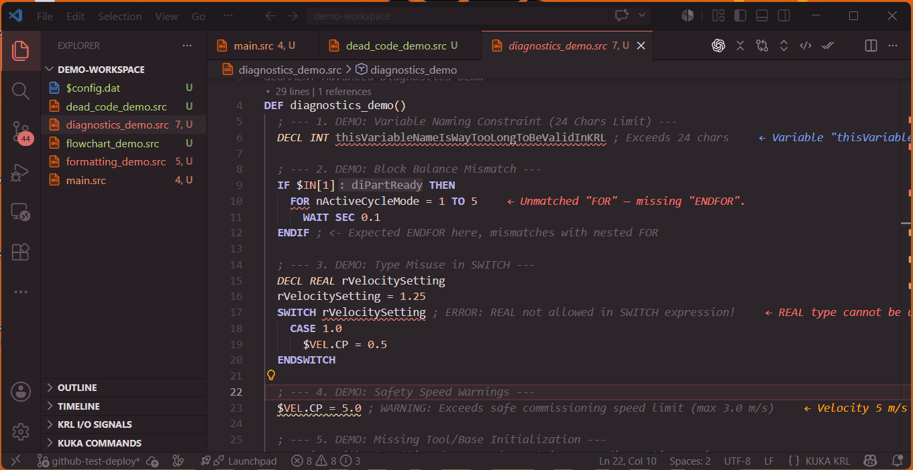

  

<h1 align="center">KUKA KRL Professional</h1>

  <b>The definitive industrial development suite for KUKA Robot Language.</b> 
  Professional-grade IDE & LSP support built for KRC4 & KRC5 robotics.

  
  

  
  
  

---

## ⚡ Engineered for Industrial Speed

Stop the slow, painful **"WorkVisual-to-Pendant-to-Controller"** iteration cycle. 

**KUKA KRL Professional** transforms VS Code and Cursor into a world-class offline IDE for industrial robot programmers. Write clean, crash-free code with real-time feedback, advanced syntax analytics, mathematical tools, and visual logic flow diagnostics before uploading files to the robot controller.

We offer two editions tailored to your workflow:
* 🟢 **Community Edition**: Core syntax support, basic autocompletion, and professional themes (100% free).
* 👑 **Pro Edition**: Advanced industrial diagnostics, structural visualization, mathematical calculators, and compliance tools designed for field engineers.

---

## 👑 Upgrade to Pro & Unlock Full Power

Investing in a **KRL Pro License** is a game-changer for commissioning engineers, paying for itself in the first hour of deployment on a factory floor.

  <a href="https://liskin.lemonsqueezy.com/checkout/buy/886efdd8-90cc-4afd-856d-5d7b076ae9b7" style="text-decoration:none;">
    <kbd style="font-size: 1.4em; padding: 12px 24px; background-color: #FF6600; color: white; border-radius: 8px; font-weight: bold; border: 1px solid #d15500; cursor: pointer; box-shadow: 0 4px 6px rgba(0,0,0,0.1);">
      🛒 Buy KRL Extension Pro License
    </kbd>
  </a>
  
Secure subscription & activation keys managed by <b>Lemon Squeezy</b> (Merchant of Record)

---

## 📊 Feature Comparison

| Feature | Community (Free) | Pro (Premium) |
| :--- | :---: | :---: |
| **KRL Syntax Highlighting** (`.src`, `.dat`, `.sub`) | ✅ | ✅ |
| **50+ Specialized Themes** (including WorkVisual Dark/Light) | ✅ | ✅ |
| **Contextual Autocomplete & Smart Folds** | ✅ | ✅ |
| **Trilingual Localization** (EN, RU, TR) | ✅ | ✅ |
| **Interactive Flowchart Viewer** (Logic mapping & navigation) | ❌ | **✅ Pro** |
| **Integrated KUKA Frame Calculator** (3-Point Method) | ❌ | **✅ Pro** |
| **Advanced Syntax & Block Balance Diagnostics** (`IF/LOOP/FOR`) | ❌ | **✅ Pro** |
| **Safety Velocity & Tool/Base Initialization Warnings** | ❌ | **✅ Pro** |
| **Workspace-wide Dead-Code Analysis** (`GLOBAL DEF` checker) | ❌ | **✅ Pro** |
| **Automated Code Quality Report Generator** | ❌ | **✅ Pro** |

---

## 🧠 Pro Features Deep-Dive

### 1. 🗺️ Interactive Flowchart Viewer
*Stop tracing nested logic by hand.* Turn massive, complex `.src` programs into visual, clean control-flow diagrams.
* **Bi-directional Navigation**: Click any block in the flowchart to jump to the exact line of code in the editor.
* **Subroutine Drill-Down**: Click subprogram calls (e.g., `GrabPart()`) to instantly load and display their flowcharts.
* **Detailed Info-mode**: Toggle flags, timers, and I/O states directly on the flowchart blocks with color indicators.
* **SVG Export**: Export vector graphics of your subprograms in one click to embed directly into client documentation.

*Preview:*

  

### 2. 🛡️ Industrial-Grade Safety & Diagnostics
*Catch syntax crashes and physical collision risks before you run the code.*
* **Strict Block Balance**: Flags missing or orphaned block endings (`IF/ENDIF`, `FOR/ENDFOR`, `LOOP/ENDLOOP`). Handles complex KRL syntax without false positives.
* **Collision Guard (Tool/Base Check)**: Warns you if movements (`PTP`, `LIN`, `CIRC`) are declared before active `$TOOL` or `$BASE` values have been initialized in the current routine.
* **High Velocity Warning**: Alerts you when speed settings exceed safe commissioning levels (e.g., `$VEL.CP` exceeding 3.0 m/s) to prevent manual test-run accidents.
* **Silent Error Blocker (Non-ASCII)**: Cyrillic comments or invisible non-ASCII characters inside executable lines cause quiet compiler failures on older KRC software. Pro checks detect and pinpoint them immediately.

*Preview:*

  

### 3. 📐 KUKA Frame Calculator
Calculate coordinate system transformations using the classic **3-Point Method** directly inside VS Code.
* No need to export coordinates to external spreadsheets or compute matrices on paper.
* Calculate `TOOL` offset or `BASE` origin transformations using measured points.
* Insert computed coordinates directly into your `.dat` files with a single click.

### 4. 📋 Automated Code Quality Reports
Ensure your code meets the high standards of automotive manufacturers (VASS, BMW, Stellantis).
* Scan the workspace for unused local variables and dead global subroutines.
* Generate a structured codebase health report to show your client or lead engineer that the code is optimized, clean, and safe.

---

## 🔒 Offline-First Guarantee (For Factory Floors)

We know that automation engineers work in interference-heavy environments, underground cells, and factories with **zero internet connection**. 

Our licensing module is built with an **Offline-First Architecture**:
* **Activation**: Connect once to activate your license key.
* **Cache**: The verified license state is safely cached on your machine.
* **Offline Access**: The extension does **not** lock you out if internet connection is lost. It will continue running all Pro features offline, only attempting to sync status silently in the background when connectivity becomes available.

---

## ⚙️ Configuration Settings

Configure extension behaviors in your `settings.json`:

| Setting | Default | Description |
|:---|:---:|:---|
| `krl.indentWidth` | `3` | Adjust indentation size (3 spaces is the KUKA standard). |
| `krl.alignAssignments` | `true` | Auto-align `=` symbols in `.dat` files for clean matrices. |
| `krl.errorLens.enabled` | `true` | Show diagnostic errors as inline text at the end of lines. |
| `krl.validateNonAscii` | `true` | Scan for characters that break older KRC compilers. |
| `krl.inlayHints.enabled` | `true` | Show descriptive names for I/O signals inline. |

---

## 📄 License & Credits

* **Publisher & Developer**: [Liskin Labs](https://github.com/LiskinLabs) / [Silvestr Liskin](https://www.linkedin.com/in/silvestr-liskin-ab712920b/)
* **Themes**: Base themes adapted from [Bearded Theme](https://github.com/BeardedBear/bearded-theme) (GPL-3.0)
* **Data Sources**: KRL grammar references based on [OpenKuka](https://github.com/openkuka)

Licensed under the GPL-3.0 License.
