

  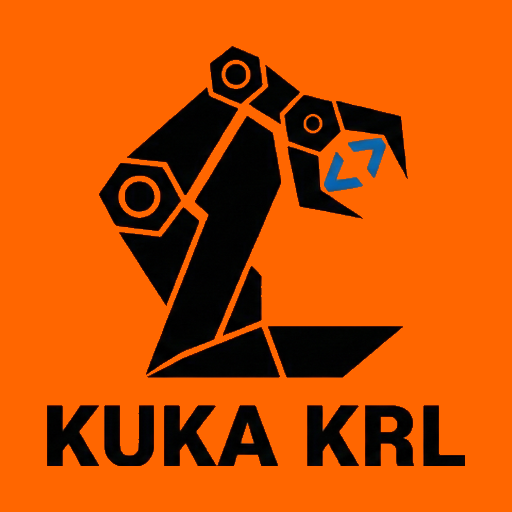

<h1 align="center">KUKA KRL Professional</h1>

  <b>The Definitive Industrial IDE & Safety Suite for KUKA Robot Language.</b> 
  Engineered for KRC2, KRC4 & KRC5 Controllers (KSS 8.2 – 8.7). Built for Speed, Safety & Zero Downtime.

  
  
  
  

  
  
  
  
  

  <a href="https://liskinlabs.github.io/kuka-krl-extension/"><b>🌐 Interactive Wiki (50 Industrial Tools)</b></a> •
  <a href="https://checkout.dodopayments.com/buy/pdc_0NmAaL3aw5WKbMZgAVCDZ"><b>⚡ 14-Day Free Trial ($9.99/mo)</b></a> • 
  <a href="https://checkout.dodopayments.com/buy/pdc_0NmAaL3aw5WKbMZgAVCDZ"><b>👑 Annual Pro ($79.00/yr - Save 35%)</b></a> • 
  <a href="https://secure.software/vscode/packages/liskinlabs/kuka-krl-extension"><b>🛡️ Security Audit Report</b></a>

---

## ⚡ The $10,000/Hour Production Stop Problem

Every commissioning robotics engineer knows the pain:
1. **The Slow Cycle**: Editing files directly on the SmartPAD teach pendant or wrestling with slow WorkVisual deployments.
2. **The Hidden Collision Risk**: A single missing `$TOOL` or `$BASE` assignment, an unverified point coordinate shift, or an accidental Cartesian `$VEL.CP` overshoot that causes a mechanical crash during the first automatic test run.
3. **The Unverified Changes**: Teammates touch up points on the robot pendant during the night shift with zero version control.

**KUKA KRL Professional** transforms your editor into a high-octane **industrial robotics command center**. It catches syntax errors, kinematic faults, missing block balances, and coordinate mismatches **BEFORE** code ever touches the physical robot controller.

> **💡 The ROI Guarantee:** Catching a single syntax crash or mechanical collision before running code on the shop floor pays for a lifetime of Pro licenses in the first 5 minutes.

---

## 🚀 Key Professional Features

### 1. 🗺️ Interactive Flowchart & Control Flow Graph
*Stop tracing nested logic by hand.* Turn massive, complex `.src` programs into clean, interactive, clickable control-flow diagrams.
* **Bi-directional Code Jumping**: Click any flowchart block to instantly jump to the exact line of code.
* **Subroutine Drill-Down**: Click subprogram calls (e.g. `PickPart()`, `WeldSeam()`) to load and inspect their flowcharts.
* **Signals & Timers**: Visual color-coded status badges for I/O signals, flags, and timers.
* **SVG Vector Export**: Export high-resolution vector diagrams for client handovers and automation documentation.

  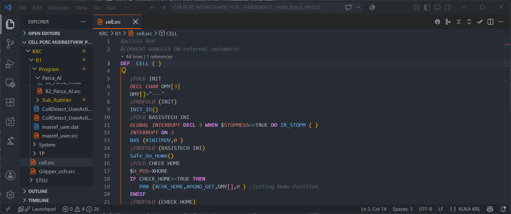

---

### 2. 🛡️ Industrial Safety & Deep Logic Analyzer
*Eliminate syntax crashes, deadlocks, and mechanical collision risks before touching the controller.*
* **Strict Block Balance**: Flags orphaned `IF / ENDIF`, `FOR / ENDFOR`, and `LOOP / ENDLOOP` blocks before KRC compilation.
* **Tool/Base Guard**: Warns if motion commands (`PTP`, `LIN`, `CIRC`) execute without active `$TOOL` or `$BASE` initialization.
* **Velocity Inspector**: Alerts when Cartesian speed `$VEL.CP` exceeds safe commissioning limits (> 2.0 m/s).
* **Deadlock Blocker**: Flags missing timeouts on `WAIT FOR` conditions and infinite loops lacking `EXIT` statements.
* **Cyrillic & Non-ASCII Blocker**: Detects accidental non-ASCII keyboard layout characters that crash older KSS compilers silently.

  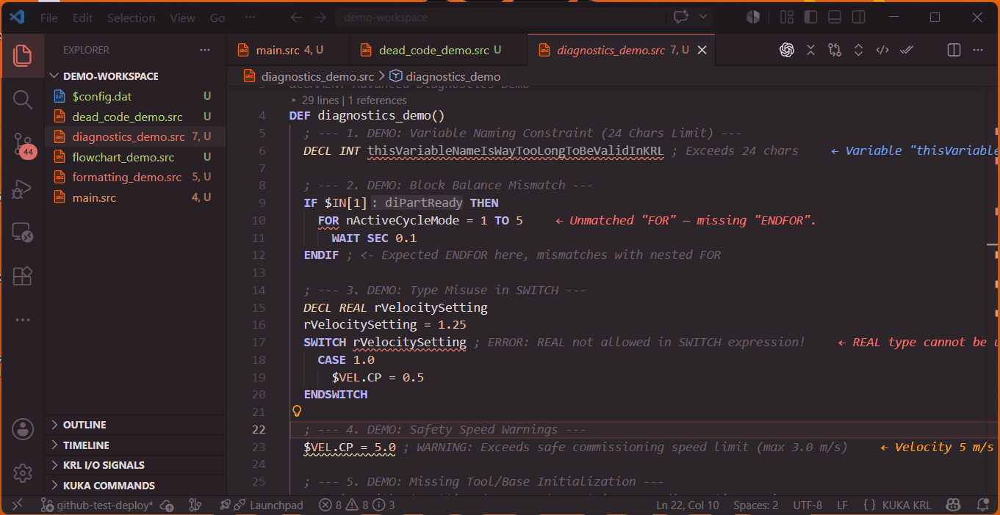

---

### 3. 📦 SmartPAD ZIP Backup Diff & Point Delta Math
*Inspect and compare live project code against SmartPAD `.zip` archive backups.*
* **Delta Math**: Calculates exact 6-axis spatial shifts (**ΔX, ΔY, ΔZ, ΔA, ΔB, ΔC**) for `E6POS`, `POS`, and `E6AXIS` points.
* **Zero-Touch Audit**: Instantly detect unverified point touch-ups made on the shop floor before they cause collisions.
* **Side-by-Side Visual Diff**: Color-coded graphical diff viewer built directly into VS Code.

  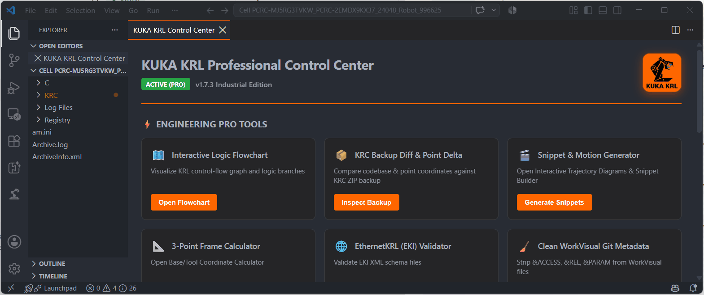

---

### 4. 🔀 GitLens-Supercharged KRL Version Control
*Track every coordinate edit and program modification with precision.*
* **Line Blame Annotations**: Instant author, timestamp, and commit details displayed in the status bar for any KRL line.
* **Commit Inspector**: Click status bar blame to inspect full commit diffs, commit metadata, and historical revisions.
* **Visual File History (`krl.viewFileHistory`)**: Compare current workspace code against any historical Git commit in a side-by-side diff.

---

### 5. 📐 3-Point Euler Frame Math & KUKA Control Center
*Direct coordinate system transformation calculator built into your editor.*
* **3-Point Method**: Compute `BASE_DATA` and `TOOL_DATA` origins and Euler rotation angles (A, B, C) from measured calibration points.
* **Direct `.dat` Insertion**: Insert calculated coordinate frames straight into data files with one click.
* **Zero Trigonometry Errors**: Eliminate spreadsheet calculations and manual orientation math on the plant floor.

  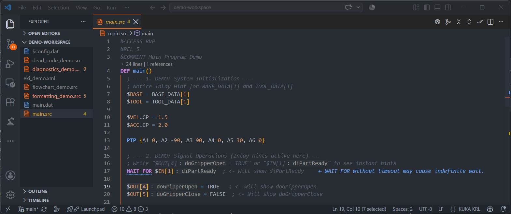

---

### 6. 🔍 Signal Inlay Hints & PLC Comment Mapping
*Understand I/O logic at a glance without flipping through electrical schematics.*
* Reads signal definitions directly from `$config.dat` and `kuka_signals.json`.
* Displays human-readable labels inline next to `$IN[x]`, `$OUT[y]`, `$ANIN[z]`, and `$FLAG[k]`.

  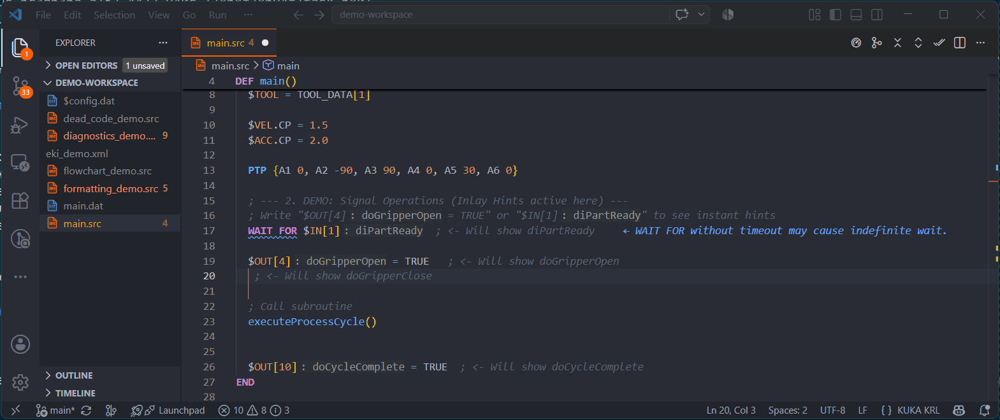

---

### 7. ⚡ Automated Code Formatter & Matrix Alignment
*Turn messy handwritten code into clean, standardized industrial code in 1 keystroke (`Shift+Alt+F`).*
* Standards-compliant 3-space KUKA indentation.
* Aligns `=` assignment operators in `.dat` files for readable coordinate matrices.
* Case standardization for KRL keywords (`DEF`, `GLOBAL`, `INTERRUPT`, `CONTINUE`).

  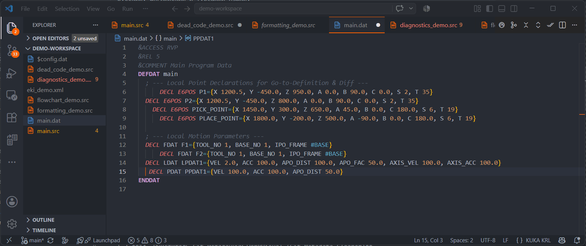

---

### 8. 💡 Smart Context Autocomplete & Snippets
*Type at the speed of thought.* Instant code completion across 350+ KSS system variables, motion commands, structured types, and subroutines.

  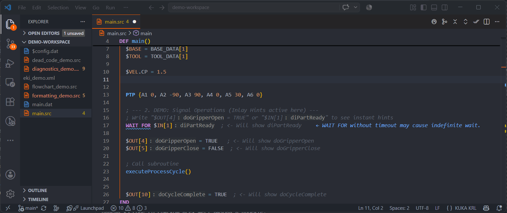

---

### 9. 🔎 Go-to-Definition & Find All References
*Instant AST-level indexing across your entire project folder.* Jump from any function or variable call straight to its declaration across separate `.src` and `.dat` files.

  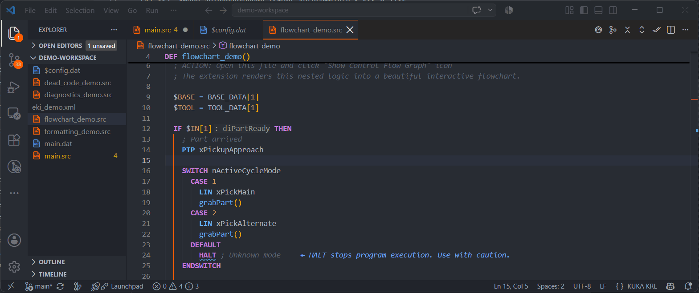

---

### 10. ℹ️ Rich Hover Documentation & Read/Write Status
*Get instant parameter explanations and safety warnings.* Hover over any KSS system variable to see its physical units, read/write permissions, and KSS manual descriptions.

  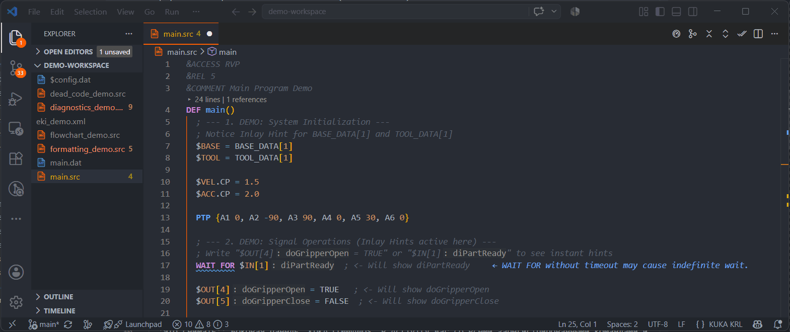

---

### 11. 🧹 Clean Git Metadata & WorkVisual Header Stripper
*Keep version control clean.* Strip WorkVisual headers (`&ACCESS`, `&REL`, `&PARAM`, `&COMMENT`) with one click to prevent noisy git diffs on automated commits.

  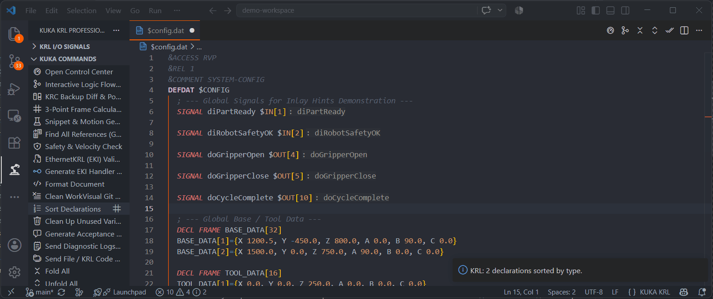

---

### 12. ⚙️ Modern KRL & iiQKA Fold Suite
*Upgrade your code to modern KUKA standards in 1 click.*
* **Convert Selection to iiQKA Fold (`krl.wrapIiQkaFold`)**: Wrap custom logic into standard iiQKA collapsible blocks.
* **Convert to Spline Block (`krl.wrapSplineBlock`)**: Wrap linear and circular motions into high-performance `SPLINE` / `ENDSPLINE` blocks for KSS 8.3–8.7.
* **Collision Guard Injector (`krl.insertCollisionGuard`)**: Automatically inject `$TORQMON` torque monitoring frames around critical motion zones.
* **Clean & Unwrap Folds (`krl.cleanUnwrapFolds`)**: Safely unwrap obsolete Inline Forms while preserving internal motion instructions.

---

### 13. 💬 Live Support Gateway & Remote Telepresence
*Direct two-way support chat with developers right inside VS Code.*
* **Interactive Chat Panel**: Instant forum-based thread synchronization with development engineering support.
* **Smart Diff & Apply**: One-click review and automatic application of code fixes suggested by technical support.
* **Remote Telepresence & Diagnostics**: Optional secure telemetry commands (`/ai_diag`, `/logs`, `/sysinfo`, `/ping`) for rapid plant commissioning assistance.

---

### 14. 🗂️ Quick Fold Toolbar & Sort Declarations
*Manage massive programs with ease.* One-click folding of FOLD blocks, subprograms, and automatic sorting of variable declarations.

  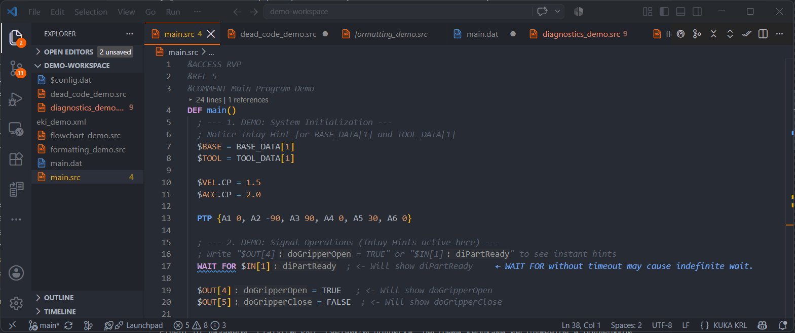

---

### 15. 💀 Dead Code & Unused Global Function Analysis
*Prevent code bloat and leftover test routines.* Identify uncalled subroutines, unused variables, and unreachable code branches across your entire workspace.

  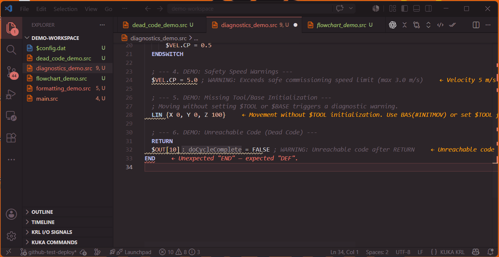

---

## 📊 Feature Comparison Matrix (50 Industrial Tools)

| Feature | Community (Free) | Pro Industrial | Benefit for Engineers |
|:---|:---:|:---:|:---|
| **KRL Syntax Highlighting** (`.src`, `.dat`, `.sub`, `.kfd`) | ✅ | ✅ | Full AST coloring for all KUKA file formats |
| **Smart Autocomplete** (350+ KSS vars) | ✅ | ✅ | Instant completion for motions, structures & system vars |
| **6 Contrast Themes** (Midnight OLED, WorkVisual, Blueprint) | ✅ | ✅ | Designed for outdoor sunlight & dark plant cells |
| **Signal Inlay Hints & Hover Docs** | ✅ | ✅ | Inline PLC signal labels & parameter signatures |
| **Code Formatter & Matrix Alignment** | ✅ | ✅ | Instant 1-click cleanup (`Shift+Alt+F`) |
| **GitLens Line Blame & Revision History** | ✅ | ✅ | Instant author & commit tracking for every point |
| **Trilingual Localization** (EN, RU, TR) | ✅ | ✅ | Full native UI & diagnostic messages |
| **Clean Git Metadata Stripper** | ✅ | ✅ | Strips WorkVisual headers for pristine Git diffs |
| **Modern KRL & iiQKA Fold Suite** | ❌ | **✅ Pro** | iiQKA Folds, Spline Blocks & Collision Guard |
| **Interactive Flowchart Viewer** (Mermaid SVG) | ❌ | **✅ Pro** | Visual control-flow logic & 2-way code jump |
| **Strict Block Balance Diagnostic** | ❌ | **✅ Pro** | Catches unclosed `IF/LOOP/FOR` blocks |
| **Velocity & Safety Inspector** ($VEL.CP) | ❌ | **✅ Pro** | Prevents dangerous Cartesian overspeeds |
| **Tool / Base Guard** | ❌ | **✅ Pro** | Flags motion before frame initialization |
| **SmartPAD ZIP Backup Diff & Point Delta** | ❌ | **✅ Pro** | Computes exact coordinate deltas (ΔX, ΔY, ΔZ) |
| **3-Point Euler Frame Math Calculator** | ❌ | **✅ Pro** | Calculates `BASE_DATA`/`TOOL_DATA` in editor |
| **EthernetKRL (EKI) XML Suite** | ❌ | **✅ Pro** | Live XML template generator & validator |
| **Live Support Gateway & Remote Telepresence** | ❌ | **✅ Pro** | Direct 2-way helpdesk chat, Diff & Apply |
| **Dead Code & Scope Checker** | ❌ | **✅ Pro** | Finds unused variables & dead subroutines |
| **Motion Diagrams & Spline Generator** | ❌ | **✅ Pro** | Visualizes spline curves for KSS 8.3+ |
| **100% Offline Factory Access** | ✅ | **✅ Pro** | Zero internet required on shop floor |

---

## 👑 Upgrade to Pro: Pricing & Instant Licensing

We offer flexible, industrial-grade licensing through our verified merchant of record, **Dodo Payments**. All transactions are encrypted and support Credit Cards, Apple Pay, Google Pay, and PayPal across 135+ countries with automatic VAT/tax invoices.

### 💳 Plans:

| Plan | Price | Trial / Discount | License Terms | Checkout |
|:---|:---:|:---|:---|:---:|
| 🟢 **Community** | **$0** | 100% Free Forever | Personal & Commercial Use | [Install Free](https://marketplace.visualstudio.com/items?itemName=LiskinLabs.kuka-krl-extension) |
| ⏱️ **Pro Monthly** | **$9.99** / mo | **14-Day Free Trial** ($0.00 today) | All 50 Industrial Pro Tools • 2 Workstations | [Start 14-Day Trial](https://checkout.dodopayments.com/buy/pdc_0NmAaL3aw5WKbMZgAVCDZ) |
| 👑 **Pro Annual** | **$79.00** / yr | **Save 35%** (~$6.58/mo) | All 50 Industrial Pro Tools • 3 Workstations • 30-Day Offline Buffer | [Get Annual Pro](https://checkout.dodopayments.com/buy/pdc_0NmAaL3aw5WKbMZgAVCDZ) |
| 🏆 **Pro Lifetime** | **$349.00** | **Pay Once, Own Forever** | All 50 Industrial Pro Tools • 5 Workstations • Lifetime Updates | [Get Lifetime Pro](https://checkout.dodopayments.com/buy/pdc_0NmAaL3aw5WKbMZgAVCDZ) |

  <a href="https://checkout.dodopayments.com/buy/pdc_0NmAaL3aw5WKbMZgAVCDZ" style="text-decoration:none;">
    <kbd style="font-size: 1.25em; padding: 14px 32px; background-color: #FF6600; color: white; border-radius: 10px; font-weight: bold; border: 1px solid #d15500; cursor: pointer; box-shadow: 0 4px 18px rgba(255,102,0,0.4);">
      ⚡ Choose Plan & Start 14-Day Free Trial (Dodo Checkout)
    </kbd>
  </a>
  
Instant 1-Click VS Code activation • 14-Day Grace Period Protection • 30-Day Offline Buffer

---

## 🔒 14-Day Grace Period & Offline-First Guarantee

Commissioning engineers work in interference-heavy plants, clean rooms, and automotive cells with **zero network connectivity**.

* 📶 **30-Day Offline-First Buffer**: Activate once and work completely offline on the plant floor for up to 30 days without network handshakes.
* 🛡️ **14-Day Grace Period**: If an international payment method or card renewal temporarily fails while you are on site, Pro features **will never lock you out mid-commissioning**. The extension provides a 14-day grace window with smart automatic background retries.

---

## 🛡️ Enterprise Security Certification

KUKA KRL Professional is certified by **ReversingLabs Spectra Assure** with a **100% Security Health Score**:
* 🟢 **0 Malware** (Clean binary inspection)
* 🟢 **0 CVE Vulnerabilities** in all dependencies
* 🟢 **0 Secret / Token Leaks**
* 🟢 **0 MITRE ATT&CK Indicators**

Official Security Audit: [https://secure.software/vscode/packages/liskinlabs/kuka-krl-extension](https://secure.software/vscode/packages/liskinlabs/kuka-krl-extension)

---

## ⌨️ Keyboard Shortcuts

| Shortcut | Action | Scope |
|:---|:---|:---|
| `Shift + Alt + F` | Format Document (KRL 3-space indentation & matrix align) | Active Editor |
| `Ctrl + Alt + F` | Open Interactive Flowchart / Control Flow Graph | `.src` File |
| `Ctrl + Alt + D` | Run Industrial Safety & Diagnostic Inspection | Workspace |
| `Ctrl + Alt + B` | Open SmartPAD Backup Diff & Point Delta Inspector | Active Project |
| `Ctrl + Alt + K` | Launch KUKA Control Center & 3-Point Frame Math | Active Editor |
| `Ctrl + Space` | Trigger Smart KSS System Autocomplete | Cursor Position |

---

## ⚙️ Configuration Settings

Configure extension behaviors in your `settings.json`:

| Setting | Default | Description |
|:---|:---:|:---|
| `krl.indentWidth` | `3` | Indentation size (3 spaces is the official KUKA standard). |
| `krl.alignAssignments` | `true` | Auto-align `=` symbols in `.dat` files for clean matrices. |
| `krl.errorLens.enabled` | `true` | Show diagnostic errors inline at the end of lines. |
| `krl.validateNonAscii` | `true` | Scan for Cyrillic/non-ASCII characters that break older KSS compilers. |
| `krl.inlayHints.enabled` | `true` | Show descriptive names for I/O signals inline. |

---

## 🌐 Trilingual Documentation & Wiki

* 📖 **English Documentation**: [https://liskinlabs.github.io/kuka-krl-extension/](https://liskinlabs.github.io/kuka-krl-extension/)
* 🇷🇺 **Русская документация и Вики**: [https://liskinlabs.github.io/kuka-krl-extension/ru/](https://liskinlabs.github.io/kuka-krl-extension/ru/)
* 🇹🇷 **Türkçe Dokümantasyon ve Wiki**: [https://liskinlabs.github.io/kuka-krl-extension/tr/](https://liskinlabs.github.io/kuka-krl-extension/tr/)

---

## 📄 License & Credits

* **Publisher & Developer**: [Liskin Labs](https://github.com/LiskinLabs) / [Silvestr Liskin](https://www.linkedin.com/in/silvestr-liskin-ab712920b/)
* **Security Auditor**: [ReversingLabs Spectra Assure](https://secure.software/vscode/packages/liskinlabs/kuka-krl-extension)
* **Official Merchant of Record**: [Dodo Payments](https://dodopayments.com/)
