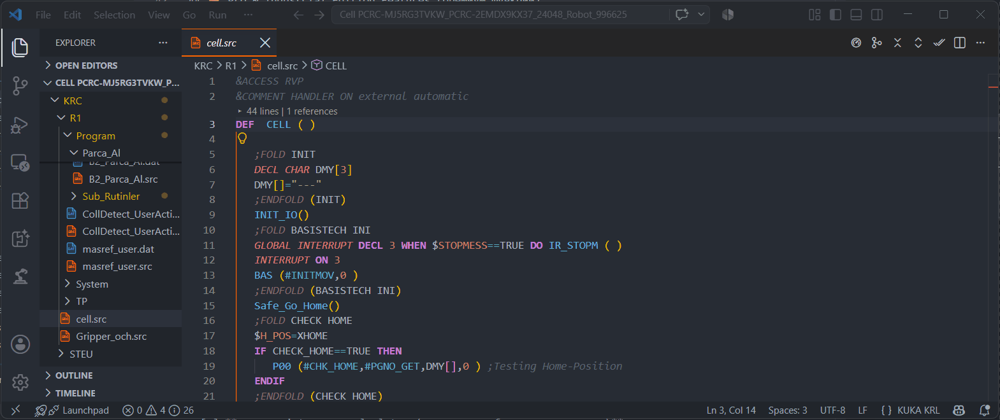

<h1 align="center">KUKA KRL Professional</h1>

  <b>The Definitive Industrial IDE & Safety Suite for KUKA Robot Language.</b> 
  Engineered for KRC2, KRC4 & KRC5 Controllers (KSS 8.2 – 8.7). Built for Speed, Safety & Zero Downtime.

🌐 Language / Язык / Dil / Sprache / Lingua / Idioma

| Language | File |
|---|---|
| 🇬🇧 English | [README.md](https://github.com/LiskinLabs/kuka-krl-extension/blob/main/README.md) |
| 🇷🇺 Русский | [README.ru.md](https://github.com/LiskinLabs/kuka-krl-extension/blob/main/README.ru.md) |
| 🇹🇷 Türkçe | [README.tr.md](https://github.com/LiskinLabs/kuka-krl-extension/blob/main/README.tr.md) |
| 🇩🇪 Deutsch | [README.de.md](https://github.com/LiskinLabs/kuka-krl-extension/blob/main/README.de.md) |
| 🇮🇹 Italiano | [README.it.md](https://github.com/LiskinLabs/kuka-krl-extension/blob/main/README.it.md) |
| 🇪🇸 Español | [README.es.md](https://github.com/LiskinLabs/kuka-krl-extension/blob/main/README.es.md) |

  
  
  
  
  

  <a href="https://liskinlabs.github.io/kuka-krl-extension/"><b>🌐 Complete Wiki & 50 Industrial Tools</b></a> •
  <a href="https://checkout.dodopayments.com/buy/pdt_0NmAUzwdbzeERSktsOLTp"><b>⚡ Pro Monthly ($9.99/mo)</b></a> • 
  <a href="https://checkout.dodopayments.com/buy/pdt_0NmAV012KFHSjUMyDomJ6"><b>👑 Annual Pro ($79.00/yr - Save 35%)</b></a> • 
  <a href="https://secure.software/vscode/packages/liskinlabs/kuka-krl-extension"><b>🛡️ Security Audit Report</b></a>

---

## ⚡ The $10,000/Hour Production Stop Problem

Every commissioning robotics engineer knows the pain:
1. **The Slow Cycle**: Editing files directly on the SmartPAD teach pendant or wrestling with slow deployments.
2. **The Hidden Collision Risk**: A single missing `$TOOL` or `$BASE` initialization, an unverified point coordinate shift, or an accidental Cartesian `$VEL.CP` overshoot that causes a mechanical crash during the first automatic test run.
3. **The Unverified Changes**: Teammates touch up points on the robot pendant during the night shift with zero version control.

**KUKA KRL Professional** transforms your editor into a high-octane **industrial robotics command center**. It catches syntax errors, kinematic faults, missing block balances, and coordinate mismatches **BEFORE** code ever touches the physical robot controller.

> **💡 The ROI Guarantee:** Catching a single syntax crash or mechanical collision before running code on the shop floor pays for a lifetime of Pro licenses in the first 5 minutes.

---

## 🚀 Key Industrial Pillars

  

### 1. 🗺️ Interactive Flowcharts & Logic Visualization
* **Clickable Control Flow Diagrams**: Turn massive `.src` files into clean, interactive Mermaid SVG diagrams with bi-directional navigation straight to code lines.
* **Subroutine Drill-Down**: Click subprogram calls (`PickPart()`, `WeldSeam()`) to inspect sub-flowcharts.
* **SVG Vector Export**: Export high-resolution vector diagrams for customer acceptance documentation.

---

### 2. 🛡️ Industrial Safety & Deep Logic Analyzer (ISO 13849)
* **Strict Block Balance**: Flags orphaned `IF / ENDIF`, `FOR / ENDFOR`, and `LOOP / ENDLOOP` blocks before KRC compilation.
* **Tool/Base Guard**: Warns if motion commands (`PTP`, `LIN`, `CIRC`) execute without active frame initialization.
* **Velocity & Acceleration Guard**: Alerts when Cartesian speed `$VEL.CP` exceeds safe commissioning limits (> 2.0 m/s).
* **Automotive VASS 26 Rules**: Linter compliance for Volkswagen/Audi Body-in-White automation cells (`VE=0%` on `SPSMAKRO`, `A23=AUS` interlocks).

---

### 3. 📐 6D Offline Kinematics & Trajectory Engine
* **6D Trajectory Mirroring (`krl.mirrorTrajectory`)**: Cartesian reflection across Planes X, Y, Z with automated Turn bit manipulation ($A_1..A_6$).
* **Batch Point Transformation (`krl.batchShiftPoints`)**: 6D geometric operator multiplication (`:`) for Tool offsets, Base offsets, and direct vector shifts.
* **Trajectory Reversal (`krl.reverseTrajectory`)**: Inverts sequence of motion targets while preserving circular arcs (`CIRC`) and inline form folds.
* **Sequential Point Renumbering (`krl.renumberPoints`)**: Synchronized batch renaming of points across `.src` motions, inline form folds, and companion `.dat` symbols (`XP1`, `FP1`, `PPDAT1`).
* **Tool & Base Coordinate Inspector (`krl.toolBaseOverview`)**: Extracts and visualizes all 64 `$TOOL_DATA` and `$BASE_DATA` frames with CSV export.

---

### 4. 📦 SmartPAD ZIP Backup Diff & Point Delta Math
* **Spatial Coordinate Deltas**: Calculates exact 6-axis shifts (**ΔX, ΔY, ΔZ, ΔA, ΔB, ΔC**) between teach versions in `.zip` archives.
* **Zero-Touch Audit**: Instantly detect unverified point touch-ups made on the shop floor before they cause collisions.
* **Side-by-Side Monaco Diff**: Color-coded graphical diff viewer built directly into VS Code.

---

### 5. 🏭 Authentic KSS 8.2–8.7 System Kernel & Specs
* **957 System Variables**: Exhaustive coverage of KSS system variables (`$ACC`, `$TOOL`, `$BASE`, `$POS_ACT`) with physical units and array bounds.
* **116 Built-in System Functions**: Kinematics (`FORWARD`, `INVERSE`, `INV_POS`), string manipulation, message dialogs, and torque limits with real-time `signatureHelp`.
* **23 Official Inline Form Snippets**: Authentic KUKA templates (`ptpi`, `slini`, `sptpi`, `scirc`, `PTPCo`, `trigdist`) with complete headers (`;FOLD ... ;%{PE}`).
* **Native EVT Event Log Viewer**: High-speed zero-dependency decoder for binary `.evt` event archives with 2,050+ official KSS messages across 6 languages.

---

## 📊 Feature Comparison Matrix

| Feature | Community (Free) | Pro Industrial | Benefit for Engineers |
|:---|:---:|:---:|:---|
| **KRL Syntax Highlighting & Themes** (`.src`, `.dat`, `.sub`, `.kfd`) | ✅ | ✅ | Full AST coloring & authentic KUKA.Sim dark/light themes |
| **Smart Autocomplete & System Specs** (957+ vars, 116 functions) | ✅ | ✅ | Full KSS parameter completion & signature help |
| **KSS Standard System Library & F12 Go to Definition** | ✅ | ✅ | Instant jump across `.src` and companion `.dat` files |
| **1-Click KRC Project Scaffolding** | ✅ | ✅ | Initializes standard `KRC/R1/System` folder structure |
| **23 Official Inline Form Snippets** (34 motion & logic templates) | ✅ | ✅ | Full `;FOLD ... ;%{PE}` templates |
| **Code Formatter & Matrix Alignment** (`Shift+Alt+F`) | ✅ | ✅ | 3-space KUKA indentation & assignment alignment |
| **GitLens Line Blame & Revision History** | ✅ | ✅ | Instant author & commit tracking for every coordinate edit |
| **Hexa-Locale Architecture** (EN, DE, IT, ES, RU, TR) | ✅ | ✅ | 100% native UI across 6 languages |
| **Clean Git Metadata Stripper** | ✅ | ✅ | Strips WorkVisual headers for clean Git commits |
| **Interactive Flowchart & Control Flow Graph** | ❌ | **✅ Pro** | Visual control-flow logic, 2-way code jump & SVG export |
| **Strict Block Balance Diagnostic** | ❌ | **✅ Pro** | Catches unclosed `IF/LOOP/FOR` blocks before KRC crashes |
| **Tool / Base & Velocity Safety Guard** | ❌ | **✅ Pro** | Flags uninitialized frames and dangerous overspeeds |
| **6D Trajectory Mirroring & Batch Shifts** | ❌ | **✅ Pro** | 6D geometric operator (`:`), Planes X/Y/Z reflection & Turn bitmath |
| **Trajectory Reversal & Point Renumbering** | ✅ | **✅ Pro** | Invert motion path sequence, synchronized `.src` and `.dat` renaming |
| **SmartPAD ZIP Backup Diff & Point Delta Math** | ❌ | **✅ Pro** | Computes spatial coordinate deltas (ΔX, ΔY, ΔZ) |
| **Automotive VASS 26 Linter & VW_USER Tech** | ❌ | **✅ Pro** | Tier-1 Body-in-White automation compliance |
| **Decode & View KUKA Event Log (.evt)** | ❌ | **✅ Pro** | Native pure-TS EVTX decoder, 2,050+ msgs in 6 languages |
| **Visual I/O Signal Matrix & Bit Collision Detector** | ❌ | **✅ Pro** | Scans signals, detects electrical address overlap & CSV export |
| **Trajectory Path Length & Seam Welding Stats** | ❌ | **✅ Pro** | 3D spatial Euclidean distance, seam lengths & arc-on times |
| **Modern KRL & iiQKA Fold Suite** | ❌ | **✅ Pro** | Convert legacy motions to modern Splines, wrap Spline blocks |
| **3-Point Euler Frame Math Calculator** | ❌ | **✅ Pro** | Calculates `BASE_DATA`/`TOOL_DATA` origins directly in editor |
| **EthernetKRL (EKI) XML Suite** | ❌ | **✅ Pro** | Live XML template generator & telegram socket validator |
| **100% Offline Factory Access** | ✅ | **✅ Pro** | Zero internet required on the plant floor (HWID node-lock) |

---

## 👑 Pricing & Instant Licensing

We offer flexible, industrial-grade licensing through our verified merchant of record, **Dodo Payments**. All transactions support Credit Cards, Apple Pay, Google Pay, and PayPal across 135+ countries with automatic VAT/tax invoices.

| Plan | Price | Billing | Features & Scope | Checkout |
|:---|:---:|:---|:---|:---:|
| 🟢 **Community** | **$0** | Free Forever | Syntax, Autocomplete, Formatter, GitLens, Basic Tools | [Install Free](https://marketplace.visualstudio.com/items?itemName=LiskinLabs.kuka-krl-extension) |
| ⏱️ **Pro Monthly** | **$9.99** / mo | Monthly | All 50 Industrial Pro Tools • 1 PC • KRC2/KRC4/KRC5 | [Get Pro Monthly](https://checkout.dodopayments.com/buy/pdt_0NmAUzwdbzeERSktsOLTp) |
| 👑 **Annual Pro** | **$79.00** / yr | Annual (Save 35%) | All 50 Industrial Pro Tools • 1 PC • Priority Support | [Get Annual Pro](https://checkout.dodopayments.com/buy/pdt_0NmAV012KFHSjUMyDomJ6) |

> 🏢 **Enterprise & Site Invoicing:** Need multi-seat team licenses or bank wire transfers (EUR/USD)? Run `krl.requestCorporateInvoice` inside VS Code or email **licensing@teknorob.com**.

---

## 🌐 Documentation & Knowledge Base

Visit our complete interactive documentation portal for in-depth tutorials, API references, and industrial case studies:

* 📖 **English Documentation**: [https://liskinlabs.github.io/kuka-krl-extension/](https://liskinlabs.github.io/kuka-krl-extension/)
* 🇷🇺 **Русская документация и Вики**: [https://liskinlabs.github.io/kuka-krl-extension/ru/](https://liskinlabs.github.io/kuka-krl-extension/ru/)
* 🇹🇷 **Türkçe Dokümantasyon ve Wiki**: [https://liskinlabs.github.io/kuka-krl-extension/tr/](https://liskinlabs.github.io/kuka-krl-extension/tr/)

---

## ⚖️ Trademarks & Legal Disclaimer

* **KUKA®, KRL®, KRC®, WorkVisual®, and SmartPAD®** are registered trademarks of **KUKA AG** / **KUKA Deutschland GmbH**.
* **Visual Studio Code® and VS Code®** are registered trademarks of **Microsoft Corporation**.
* This software extension is an independent development by **Liskin Labs** and is **not** affiliated with, sponsored, endorsed, or certified by KUKA AG, Microsoft Corporation. All product names, logos, and brands are property of their respective owners and are used solely for identification and compatibility purposes under nominative fair use.
