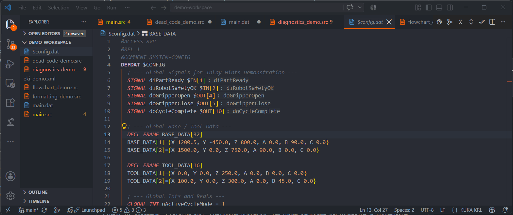

<h1 align="center">KUKA Engineering Toolkit for VS Code</h1>

  <b>Industrial static analysis, pre-deployment diagnostics, backup intelligence & safe auto-repair for KUKA robotics.</b> 
  <i>The complete offline engineering suite for VS Code.</i> 
  Engineered for <b>KRC2, KRC4 & KRC5 Controllers (KSS 5.x – 8.7+)</b> and <b>VKRC (VASS 26)</b>.

Language / Язык / Dil / Sprache / Lingua / Idioma

| Language | File |
|---|---|
| English | [README.md](https://github.com/LiskinLabs/kuka-krl-extension/blob/main/README.md) |
| Русский | [README.ru.md](https://github.com/LiskinLabs/kuka-krl-extension/blob/main/README.ru.md) |
| Türkçe | [README.tr.md](https://github.com/LiskinLabs/kuka-krl-extension/blob/main/README.tr.md) |
| Deutsch | [README.de.md](https://github.com/LiskinLabs/kuka-krl-extension/blob/main/README.de.md) |
| Italiano | [README.it.md](https://github.com/LiskinLabs/kuka-krl-extension/blob/main/README.it.md) |
| Español | [README.es.md](https://github.com/LiskinLabs/kuka-krl-extension/blob/main/README.es.md) |

  
  
  
  
  
  

  <a href="https://liskinlabs.github.io/kuka-krl-extension/"><b>Documentation Wiki</b></a> •
  <a href="https://checkout.dodopayments.com/buy/pdt_0NmAUzwdbzeERSktsOLTp"><b>Engineer Pro ($19.00/mo)</b></a> • 
  <a href="https://checkout.dodopayments.com/buy/pdt_0NmAV012KFHSjUMyDomJ6"><b>Annual Pro ($149.00/yr)</b></a> • 
  <a href="https://checkout.dodopayments.com/buy/pdt_0NnLCdgD69GiXDLRJ0K5v"><b>Team Edition ($499.00/yr)</b></a> •
  <a href="https://secure.software/vscode/packages/liskinlabs/kuka-krl-extension"><b>Security Audit</b></a>

---

## Before the Robot: Zero Downtime on the Plant Floor

> **Catch syntax bugs, unclosed FOLDs, deadlocks, coordinate drift, and Advance Run drops in VS Code before downloading code to the physical controller.**

* **Prevent Costly Line Stops**: Verify Tool/Base definitions, motion boundaries, and `SPS.SUB` tasks before production ramps.
* **SmartPAD Backup Intelligence**: Audit backup archives (`.zip` / `KRCDiag`) and detect night-shift point touch-ups with exact $\Delta X, \Delta Y, \Delta Z$ coordinate deltas.
* **Automated Acceptance Protocols**: Generate comprehensive cell quality audit reports (Markdown & PDF) for OEM and customer sign-off.
* **Deterministic Safe Auto-Repair**: Fix thousands of structural fold desyncs and syntax faults in 1 click with AST rollback protection and Monaco diff review.

---

## The Reality of Industrial Commissioning & Immediate ROI

Every robotics commissioning engineer and plant system integrator knows the stakes:

1. **Unplanned Line Stops ($10,000+ / hour)**: A single uninitialized `$TOOL` or `$BASE`, an Advance Run drop triggering axis jerk, or an unexpected division-by-zero in `SPS.SUB` halts the automation cell during production ramps.
2. **Night-Shift Point Drift**: Operators touch up taught points directly on the SmartPAD pendant without revision tracking. Discovering what changed requires tedious manual comparison of dozens of `.dat` files.
3. **Slow Feedback Loops**: Transferring code to physical controllers or booting heavy virtual setups just to catch basic syntax or fold mismatches wastes critical commissioning hours.

> 💡 **ROI Guarantee:** Catching a single uninitialized coordinate frame, reach envelope violation, or unclosed FOLD before downloading to the controller pays for an entire year of Team Edition in the first 5 minutes.

---

## The Five Core Engineering Workflows

### 1. AUDIT & REPORT: Pre-Flight Safety & Quality Acceptance Protocols [PRO]
Static code analysis designed specifically for KRL runtime behavior:
* **Automated Cell Quality & Acceptance Protocol (`krl.generateAcceptanceReport`)**: Generates complete technical handover reports with Health Score (0–100%), Vorlaufstopp cycle time penalty calculation (~250–450 ms per point), deadlock detection, and reach envelope validation across 183 cataloged KUKA robot models. Exportable to Markdown and PDF for customer acceptance.
* **Frame & Tool Assignment Guard**: Verifies active `$TOOL` and `$BASE` initialization before any Cartesian motion (`LIN`, `CIRC`, `SLIN`, `SCIRC`) to prevent uncontrolled manipulator trajectories.
* **Advance Run & Path Blending Guard**: Identifies peripheral I/O statements (`$OUT`, `$IN`, `WAIT FOR`) inside motion sequences that drop `$ADVANCE` to 0, with precision recommendations for `TRIGGER WHEN PATH / DISTANCE` and `CONTINUE`.
* **Deadlock & Wait Scanner**: Detects unconditioned `WAIT FOR $IN[...]` conditions and unhandled handshakes that can freeze production cycles.
* **Background SPS Submit Guard**: Audits `SPS.SUB` and background tasks for blocking statements (`WAIT SEC`, `WAIT FOR`) and potential arithmetic faults that can crash the controller's safety task.
* **Physical Reach Limit Validation**: Validates Cartesian target coordinates against reach boundaries of 183 KUKA robot models cataloged from official kinematics specifications.
* **Automotive VASS 26 Linter**: Enforces Volkswagen / Audi Group Body-in-White automation rules (`VE=0%` on `SPSMAKRO`, `A23=AUS` confirmation interlocks).

  

---

### 2. COMPARE: SmartPAD Backup Diff & Kinematic Math [PRO]
Deep inspection of KUKA controller backups without disk extraction:
* **Zero-Unpack Archive Inspection**: Open and explore `.zip` backups and `KRCDiag_*.zip` diagnostic packages in-memory via virtual `krc-archive://` protocol.
* **Spatial Coordinate Delta ($\Delta$) Calculation**: Computes exact Cartesian and axis deltas between backup versions:
  $$\Delta X, \Delta Y, \Delta Z, \Delta A, \Delta B, \Delta C$$
* **Shop-Floor Touch-Up Audit**: Instantly identify which points were retaught on the robot pendant during night shifts, highlighting subtle tool offsets.
* **Native EVT Event Log Viewer**: High-speed pure-TypeScript decoder for binary `.evt` controller logs, resolving 2,050+ official KSS diagnostic events across 6 languages with error filtering and 1-click jump to `.src` line.
* **Live Transparent ZIP Project Mount (`krl.mountBackupZipAsProject`)**: Open any KRC backup archive directly as a workspace. Saving files (`Ctrl+S`) updates the `.zip` archive on disk in <80ms without UI locking.

  

---

### 3. NAVIGATE & VISUALIZE: Interactive Control Flow & KRC Control Center
* **Interactive Control Flow Graph & Flowchart**: Visualizes deeply nested `.src` routines, subprogram call graphs, and branching logic with bidirectional jump to code, color badges for I/O and timers, and high-resolution SVG export.
* **KRC Control Center & Activity Bar**: One-click access to tools, backup mounts, signal matrices, and documentation directly from the sidebar.
* **Quick FOLD Toolbar & Declaration Sorter**: Instant fold unfolding/folding, declaration sorting, and WorkVisual metadata cleaner (`&ACCESS`, `&REL`) for clean version control commits.

  

---

### 4. AUTO-REPAIR: Safe QuickFix & Batch Correction with Monaco Diff Review [PRO]
Deterministic one-click resolution of safety and structural issues without altering motion kinematics (`krl.fixAllSafeIssues`):
* **FOLD Header Synchronization**: Normalizes and aligns mismatched `;FOLD` and `;ENDFOLD` headers and strips malformed parentheses across hundreds of files in seconds.
* **Unclosed FOLD Auto-Capping**: Safely closes dangling `;FOLD INI` and system sections before routine termination.
* **FOR STEP 0 Elimination**: Replaces fatal `STEP 0` infinite loops with safe `STEP 1` to prevent controller lockup.
* **BRAKE Command Injection**: Guarantees mandatory deceleration command directly before `RESUME` in interrupt routines.
* **Payload Commit Injection**: Inserts active tool `BAS(#PAYLOAD, nTool)` commit calls after multi-attribute `$LOAD` assignment groups.
* **BOM & Non-ASCII Purge**: Cleans UTF-8 BOM and non-ASCII typographical characters that trigger KSS compiler panics.
* **AST Safety Rollback Guard**: Every repair is verified by an automated secondary AST syntax pass. If any new error or block imbalance is detected, the transaction is instantly rolled back to pristine code.
* **Interactive Monaco Diff Review**: Inspect candidate changes in side-by-side Red/Green diff with "Accept All", "Accept (Ctrl+Enter)", or "Reject (Esc)" before writing to disk.

  

---

### 5. TRANSFORM: Fieldbus I/O Matrix & Kinematic Modernization
Batch motion path manipulation and standard migration:
* **Visual I/O Signal Matrix**: Scans signal declarations and detects overlapping physical bit addresses across fieldbus mappings (`$IN`, `$OUT`, `$ANIN`, `$ANOUT`).
* **1-Click Spline Modernization**: Automatically converts legacy motion blocks (`PTP`, `LIN`, `CIRC`) into modern KSS 8.3–8.7 Spline blocks (`SPTP`, `SLIN`, `SCIRC`) with valid `;FOLD ... ;%{PE}` parameters and companion `.dat` data structures (`CPDAT`, `PDAT`).
* **6D Trajectory Mirroring (`krl.mirrorTrajectory`)**: Reflects Cartesian paths across planes X, Y, or Z with automated Turn bit manipulation ($A_1..A_6$).
* **Batch Point Transformation (`krl.batchShiftPoints`)**: Applies 6D geometric frame operations (`:`) for Tool offsets, Base re-referencing, and vector shifts.
* **Synchronized Point Renumbering (`krl.renumberPoints`)**: Synchronizes point renaming across `.src` motions, inline form folds, and companion `.dat` declarations (`XP1`, `FP1`, `PPDAT1`).

  

---

## Feature Comparison Matrix

| Capability | Community (Free) | Engineer Pro | Team Edition | Enterprise Site |
|:---|:---:|:---:|:---:|:---:|
| **KRL Syntax Highlighting & Themes** (`.src`, `.dat`, `.sub`, `.kfd`) | Yes | Yes | Yes | Yes |
| **Smart Autocomplete & System Specs** (957+ vars, 116 functions) | Yes | Yes | Yes | Yes |
| **KSS Standard System Library & F12 Go to Definition** | Yes | Yes | Yes | Yes |
| **Code Formatter & Indentation Alignment** (`Shift+Alt+F`) | Yes | Yes | Yes | Yes |
| **GitLens Line Blame & Version Tracking** | Yes | Yes | Yes | Yes |
| **Zero-Unpack Archive Explorer** (`.zip` / `KRCDiag`) | Yes | Yes | Yes | Yes |
| **KRL Safe Auto-Repair with AST Rollback Guard** | — | **Pro** | **Team** | **Enterprise** |
| **Interactive Flowchart & Control Flow Graph** | — | **Pro** | **Team** | **Enterprise** |
| **Pre-Flight Safety Audit & Deep Logic Analyzer** | — | **Pro** | **Team** | **Enterprise** |
| **Automated Cell Quality & Acceptance Reports (Markdown/PDF)** | — | **Pro** | **Team** | **Enterprise** |
| **SmartPAD Backup Diff & Spatial Delta Math ($\Delta X,Y,Z$)** | — | **Pro** | **Team** | **Enterprise** |
| **Live Transparent ZIP Workspace Mount & Auto-Sync** | — | **Pro** | **Team** | **Enterprise** |
| **1-Click Modern Spline Converter & Fold Generator** | — | **Pro** | **Team** | **Enterprise** |
| **6D Trajectory Mirroring, Batch Shift & Renumbering** | — | **Pro** | **Team** | **Enterprise** |
| **Binary `.evt` Event Log Viewer (2,050+ KSS codes)** | — | **Pro** | **Team** | **Enterprise** |
| **Visual I/O Signal Matrix & Bit Collision Detector** | — | **Pro** | **Team** | **Enterprise** |
| **Air-Gapped Offline Node-Locking (Factory OT Safe)** | — | **Pro (1 Workstation)** | **Team (25 Activations)** | **Site (200 Workstations)** |
| **Automotive VASS 26 Rules & VW_USER Tech** | — | **Pro** | **Team** | **Enterprise** |
| **Copilot AI Language Model Tools (`krl_safety_check`)** | — | **Pro** | **Team** | **Enterprise** |
| **B2B Invoicing & Quotations (`krl.requestCorporateInvoice`)** | Yes | Yes | Yes | Yes |
| **Basic Syntax Error & Diagnostic Checking** | Yes (Bonus) | Yes | Yes | Yes |
| **KSS 9.x / iiQWorks 9.+ & KSS 8.3–8.7 Compatibility** | Yes | Yes | Yes | Yes |
| **Company-Branded Robot Acceptance Protocols (PDF)** | — | — | — | **Enterprise** |
| **Custom Plant Linting Rules & Dedicated Priority SLA** | — | — | — | **Enterprise** |

---

## Pricing & Commercial Licensing

All commercial licenses are billed through our verified merchant of record, **Dodo Payments**. Transactions support Credit Cards, SEPA Bank Wire, ACH, Apple Pay, and Google Pay across 135+ countries with instant tax invoicing and automated VAT reverse-charge compliance.

| Tier | Price | Scope & Workstations | Target Audience | Checkout / Quote |
|:---|:---:|:---|:---|:---:|
| **Community** | **$0** | 1 Workstation | Basic editing, syntax, formatting, file inspection | [Free Install](https://marketplace.visualstudio.com/items?itemName=LiskinLabs.kuka-krl-extension) |
| **Engineer Pro (Monthly)** | **$19.00** / mo | 1 Workstation Activation | Commissioning sprints, short projects, contractor audits | [Get Pro Monthly](https://checkout.dodopayments.com/buy/pdt_0NmAUzwdbzeERSktsOLTp) |
| **Engineer Pro (Annual)** | **$149.00** / yr | 1 Workstation Activation | Senior robotics engineers, plant programmers, offline planners | [Get Annual Pro](https://checkout.dodopayments.com/buy/pdt_0NmAV012KFHSjUMyDomJ6) |
| **Pro Lifetime** | **$699.00** once | 1 Workstation Activation | Perpetual license, lifetime updates, permanent offline cert | [Get Lifetime](https://checkout.dodopayments.com/buy/pdt_0NmAcoqVCfuwQ6Xx7qyqr) |
| **Team Edition** | **$499.00** / yr | B2B — Invoice & Quote | All Industrial Pro Tools & Analyzers • 25 Workstation Activations • KRC2–KRC5 | [Get Team Edition](https://checkout.dodopayments.com/buy/pdt_0NnLCdgD69GiXDLRJ0K5v) |
| **Enterprise Site** | **$2,490.00** / yr | 200 Workstation Activations | All Industrial Pro Tools & Analyzers • 200 Plant Workstations • Branded Reports | [Get Enterprise](https://checkout.dodopayments.com/buy/pdt_0NnLCdkLwd0dECkpSE1JP) |

---

## B2B Procurement, Invoicing & Air-Gapped Factory Deployment

For corporate purchasing departments and system integrators:

* **Official Quotations & Invoices**: Generate a formal PDF commercial quotation (Angebot) directly from VS Code via command `krl.requestCorporateInvoice` (`Ctrl+Shift+P`).
* **Tax ID & EU VAT Reverse Charge**: Dodo Payments validates company VAT numbers through official databases (EU VIES, UK HMRC, US EIN) to apply 0% Reverse-Charge VAT on cross-border business purchases.
* **Corporate Wire Transfers**: Supports SEPA Bank Wire (EUR), ACH (USD), and wire transfers with automated remittance matching.
* **Air-Gapped Factory Deployment**: For isolated OT plant environments without internet access, generate signed cryptographic offline license certificates valid for 365 days.

---

## Documentation & Knowledge Portal

* **English Documentation**: [https://liskinlabs.github.io/kuka-krl-extension/](https://liskinlabs.github.io/kuka-krl-extension/)
* **Русская документация и база знаний**: [https://liskinlabs.github.io/kuka-krl-extension/ru/](https://liskinlabs.github.io/kuka-krl-extension/ru/)
* **Türkçe Dokümantasyon ve Wiki**: [https://liskinlabs.github.io/kuka-krl-extension/tr/](https://liskinlabs.github.io/kuka-krl-extension/tr/)

---

## Legal Disclaimers, Trademarks & Safety Compliance

### Mandatory Safety & Industrial Compliance (ISO 10218-1/-2 & ISO 13849-1)
**KUKA Engineering Toolkit** is an independent engineering development, static analysis, and backup diff suite developed by **Liskin Labs**. It is **NOT safety-certified software (Non-SIL / Non-PL)** and does **not** replace mandatory physical commissioning procedures, reduced override verification (`$OV_PRO <= 30%` in T1 mode on the physical KUKA SmartPAD teach pendant), or formal risk assessments required by **ISO 10218-1/-2** and **ISO 13849-1**. Always perform manual path dry-runs in T1 mode before engaging automated production.

### Trademarks & Brand Neutrality
* **KUKA®, KRL®, KRC®, WorkVisual®, iiQWorks®, and SmartPAD®** are registered trademarks of **KUKA AG** / **KUKA Deutschland GmbH**.
* **Visual Studio Code® and VS Code®** are registered trademarks of **Microsoft Corporation**.
* This software extension is an independent development by **Liskin Labs** and is **not** affiliated with, sponsored, endorsed, or certified by KUKA AG or Microsoft Corporation. All product names, logos, and brands are property of their respective owners and are used strictly for identification and interoperability purposes under nominative fair use.
