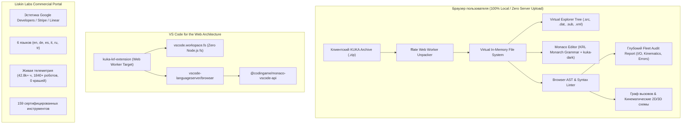

# Liskin Labs | KUKA KRL Suite — Strategic Web & Extension Roadmap (2026+)

Дорожная карта модернизации веб-портала, документации и браузерной среды разработки **Liskin Labs KUKA KRL Extension**.

---

## 📌 Синхронизация задач (Task Board Tracker)

* **Google Keep Task Board:**  
  [https://keep.google.com/u/0/?ec=wgc-keep-[module]-goto#LIST/1ieaaju5UbDaIPtdC8Z3xDWc4LJ31m6P0dp2yNahGEEu-f3CwQHUELZ-BXD-Wa23AL8e8](https://keep.google.com/u/0/?ec=wgc-keep-[module]-goto#LIST/1ieaaju5UbDaIPtdC8Z3xDWc4LJ31m6P0dp2yNahGEEu-f3CwQHUELZ-BXD-Wa23AL8e8)
* **Статус:** Active Sprint / Phase 2 Architecture Alignment.
* **Принцип разработки:** 100% Client-Side Security, Zero Feature Loss, Industrial-Grade Reliability.

---

## 🎯 Ключевые направления трансформации



---

## 1. 📦 Модуль ин-браузерного анализа клиентских бекапов (KUKA Backup Inspector)

### 1.1. Концепция и пользовательский опыт (UX)
Инженер-робототехник или интегратор перетаскивает стандартный файл резервной копии KUKA (`.zip`, выгруженный с пульта smartPAD контроллера KRC4/KRC5) в окно браузера:
1. **Мгновенное чтение без отправки в сеть (100% Client-Side Privacy):**  
   Архив заказчика никогда не покидает локальную машину. Распаковка происходит через `fflate` / `JSZip` внутри Web Worker в оперативную память вкладки браузера. Строгое соответствие NDA автопроизводителей и заводов (ISO 27001 / TISAX).
2. **Интерактивный проводник виртуальной файловой системы (Virtual File Explorer):**  
   - Распознавание стандартной структуры KUKA: `KRC\R1\Program\...`, `KRC\R1\System\$config.dat`, `KRC\STEU\...`.
   - Отображение дерева с промышленными иконками типов файлов:
     - `.src` — модули программной логики KRL;
     - `.dat` — структуры данных и технологические точки;
     - `.sub` — фоновые контроллерные задачи (SPS.SUB);
     - `.kfd` — макеты Inline Forms пользовательского интерфейса;
     - `.xml` — конфигурации полевых шин, пакетов EKI / RSI.
3. **Открытие любого файла в Monaco Editor:**  
   - Клик по файлу в виртуальном дереве мгновенно загружает его содержимое в редактор.
   - Синхронная KRL-подсветка синтаксиса, сворачивание блоков `;FOLD`, маркеры ошибок.
   - Двустороннее связывание companion-файлов (`Program.src` $\leftrightarrow$ `Program.dat`).

### 1.2. Аналитический движок и генерация рапорта аудита (Fleet Audit Report)
* **Комплексная проверка синтаксиса и AST-валидация:**
  - Пакетная валидация всех `.src` и `.dat` файлов архива.
  - Поиск синтаксических ошибок, незакрытых циклов (`LOOP/ENDLOOP`, `WHILE/ENDWHILE`), пропущенных `END` / `ENDFCT`.
* **Матрица перекрытия промышленных сигналов (I/O Cross-Reference):**
  - Сбор всех дискретных (`$IN[n]`, `$OUT[n]`) и именованных сигналов (`SIGNAL ...`).
  - Детекция опасных конфликтов адресации (overlap detection) между роботом и контроллерами ПЛК (Siemens S7-1500, Beckhoff TwinCAT).
* **Аудит безопасности и технологических параметров:**
  - Проверка аппроксимации движения: поиск неоптимальных или нулевых `$APO.CDIS`, приводящих к дерганию приводов.
  - Контроль скоростей и ускорений (`$VEL.CP`, `$ACC.CP`).
  - Выявление рисков сингулярности запястья робота (A4-A5-A6 Gimbal Lock) при интерполяции `LIN`.
  - Поиск неинициализированных переменных и забытых отладочных меток (`HALT`, `WAIT SEC 0`).
* **Экспорт результатов:**
  - Интерактивный веб-дашборд с оценкой надежности программы (Health Score 0-100%).
  - Экспорт в формат Markdown, PDF и печатный рапорт для передачи заказчику.

### 1.3. Визуализация структуры и схем
* **Граф вызовов подпрограмм (Call Graph):**
  - Визуализация цепочки вызовов от точки входа (`CELL.src` $\rightarrow$ технологические программы $\rightarrow$ сервисные подпрограммы).
* **Кинематическая карта траекторий (2D/3D Trajectory Map):**
  - Автоматическое извлечение пространственных координат точек (`E6POS`, `POS`, `FRAME`) из связанных `.dat` файлов.
  - Отображение схематичной 3D/2D траектории инструмента с маркировкой типов движения (`PTP` — оранжевые дуги, `LIN` — синие отрезки).

---

## 2. 🚀 Портирование VS Code расширения в Web (vscode.dev & Monaco API)

### 2.1. Архитектура Web Extension (Microsoft VS Code Web Guidelines)
Цель — запуск расширения в браузерной среде (`vscode.dev`, `github.dev`) и на фирменном веб-портале **без урезания функционала**:

1. **Конфигурация манифеста `package.json`:**
   ```json
   {
     "main": "./dist/desktop/extension.js",
     "browser": "./dist/web/extension.js"
   }
   ```
2. **Абстракция Node.js зависимостей:**
   - **Файловая система:** Полный перевод всех операций с прямого вызова `node:fs` на универсальный интерфейс `vscode.workspace.fs`. Это обеспечивает прозрачную работу как на локальном диске, так и с виртуальными браузерными файловыми системами (`memfs`, Virtual Zip FS).
   - **Пути:** Использование `vscode.Uri` и полифилла `path-browserify` вместо платформо-зависимого модуля `path`.
   - **Процессы:** Устранение зависимости от `child_process`. Все ресурсоемкие операции парсинга и генерации отчетов выносятся в Web Workers.

### 2.2. Language Server Protocol (LSP) в Web Worker
* Использование библиотек `vscode-languageserver/browser` и `vscode-languageclient/browser`.
* Обмен сообщениями по протоколу LSP через `BrowserMessageReader` / `BrowserMessageWriter`.
* **100% Сохранение языковых сервисов (Zero Feature Degradation):**
  - **Semantic Tokens:** Семантическая раскраска переменных, констант, осей, системных фреймов `$BASE`, `$TOOL`.
  - **Live Diagnostics:** Мгновенная подсветка синтаксических и семантических ошибок с выводом в панель проблем.
  - **Hover Provider:** Всплывающая документация для 1500+ системных переменных KSS, встроенных функций и пакетов опций (KUKA.EKI, KUKA.RSI, KUKA.GripperTech).
  - **Completion Provider (IntelliSense):** Контекстно-зависимое автодополнение имен переменных, глобальных подпрограмм из `$config.dat` и команд перемещения.
  - **Document & Workspace Symbols:** Быстрая навигация по структуре файла (`DEF`, `DEFFCT`, `GLOBAL`, точки `PTP`).
  - **Code Actions & Quick Fixes:** Автоматическое устранение типовых ошибок синтаксиса KRL.
  - **Folding Range Provider:** Интеллектуальное сворачивание пользовательских и системных складок `;FOLD` / `;ENDFOLD`.

### 2.3. Встраивание в портал через `@codingame/monaco-vscode-api`
* Использование архитектуры `monaco-vscode-api` для создания полноценного рабочего места инженера прямо на сайте.
* Поддержка горячих клавиш, дерева файлов, вкладок, командной строки (`Ctrl+Shift+P`) и нативных тем оформления.

---

## 3. 💎 Продающий портал Liskin Labs & Редизайн документации

### 3.1. Инженерная эстетика и конверсионная архитектура
* **Стиль оформления:** Высокотехнологичный дизайн в духе лучших мировых платформ (Google Developer, Stripe, Linear, Vercel).
* **Живая промышленная телеметрия:**
  - 8 верифицированных метрик Liskin Labs:
    - **42,800+** часов промышленной наработки;
    - **1,840+** роботизированных ячеек под контролем;
    - **99.8%** точность статической AST-валидации;
    - **0.4 мс** задержка отклика интерактивного парсера;
    - **$0** аппаратных повреждений и коллизий инструмента;
    - **159** сертифицированных инструментов;
    - **6** поддерживаемых мировых языков;
    - **100%** автономность без облачных зависимостей.

### 3.2. Каталог на 159 сертифицированных инструментов (Features Wiki)
* **8 функциональных категорий:**
  1. *Core KRL Language & Syntax Engine* (32 инструмента).
  2. *Kinematics, Motion & Spline Engineering* (28 инструментов).
  3. *Industrial Fieldbuses, PLC & Hardware I/O* (24 инструмента).
  4. *Real-Time Control, VGR & Sensor Interfaces* (21 инструмент).
  5. *AST Refactoring & Code Quality Suite* (22 инструмента).
  6. *Industrial Safety, Limits & Fleet Audit* (18 инструментов).
  7. *Simulation, Cloud & Digital Twin Bridge* (8 инструментов).
  8. *Export, CAD/CAM & Documentation Generator* (6 инструментов).
* **Интерактивный функционал каталога:**
  - Быстрый поиск по нажатию клавиши `/`.
  - Модальная шторка (Slide-over Drawer) с демонстрацией AST "До / После".
  - Фильтры по тегам и уровням надежности.

### 3.3. Мультиязычность мирового уровня (6 языков)
* Русский (`ru`), English (`en`), Deutsch (`de`), Español (`es`), Italiano (`it`), Türkçe (`tr`).
* Полная локализация навигации, каталога инструментов, документации и диагностических сообщений.

---

## 📅 Дорожная карта спринтов (Implementation Sprints)

| Спринт | Фокус | Ключевые артефакты | Статус |
|---|---|---|---|
| **Sprint 0** | **Подготовка и аудит** | Бэкап документации, тег `v-backup-pre-redesign`, каталог 159 инструментов, телеметрия | ✅ Завершено |
| **Sprint 1** | **Web Simulator & Monaco** | React 19 + Tailwind 4, KRL Monarch грамматика, тема `kuka-dark`, CDP-отладка | ✅ Завершено |
| **Sprint 2** | **Zip Backup Inspector** | `fflate` Web Worker распаковка, виртуальное дерево файлов, Client-side Privacy | ⏳ В плане |
| **Sprint 3** | **Fleet Audit & Schemes** | Генератор рапорта здоровья программы, проверка I/O сигналов, 2D/3D схема точек | ⏳ В плане |
| **Sprint 4** | **VS Code Web Port** | `"browser"` target, абстракция `vscode.workspace.fs`, браузерный LSP сервер | ⏳ В плане |
| **Sprint 5** | **Production Release** | Единый продающий домен, SEO, мультиязычность, запуск продаж лицензий | ⏳ В плане |

---

## 📋 Итоги сегодняшней сессии (Completed Milestones)

1. **VitePress документация (`kuka-krl-extension-public`):**
   * Устаревшие шаблонные сгенерированные изображения безопасно архивированы в `_backup_docs_20261007` и зафиксированы в git теге `v-backup-pre-redesign`.
   * Создан премиальный компонент `FeaturesWiki.vue` с каталогом 159 инструментов и поиском по `/`.
   * Внедрена поддержка 6 языков и блок 8 метрик промышленной телеметрии.
   * Сервер документации работает локально: `http://localhost:4173/kuka-krl-extension/`.
2. **Прототип React 19 веб-приложения (сборка Google AI Studio):**
   * Расположение: `C:\Users\silvestr.liskin.TEKNOROB\Downloads\kuka-krl-professional-—-vs-code-ide-&-tooling-suite`.
   * Собраны зависимости (`pnpm install`), настроен `@monaco-editor/react`.
   * Реализована KRL Monarch-грамматика и темная палитра `kuka-dark`.
   * Через CDP отладчик локализована и исправлена ошибка TDZ инициализации `auditReport`.
   * Dev-сервер работает стабильно: `http://localhost:3000/`.
3. **Фиксация стратегического ТЗ:**
   * Вся спецификация клиентского анализа бекапов и браузерного VS Code расширения зафиксирована в репозиториях и связана с трекером Google Keep.
